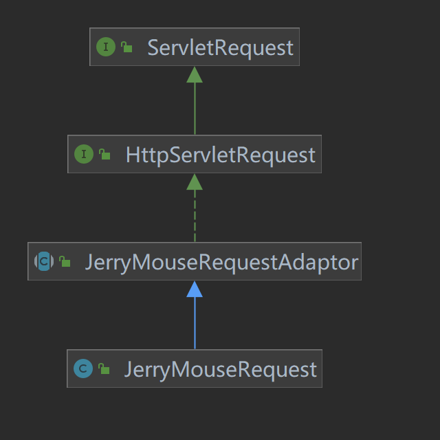
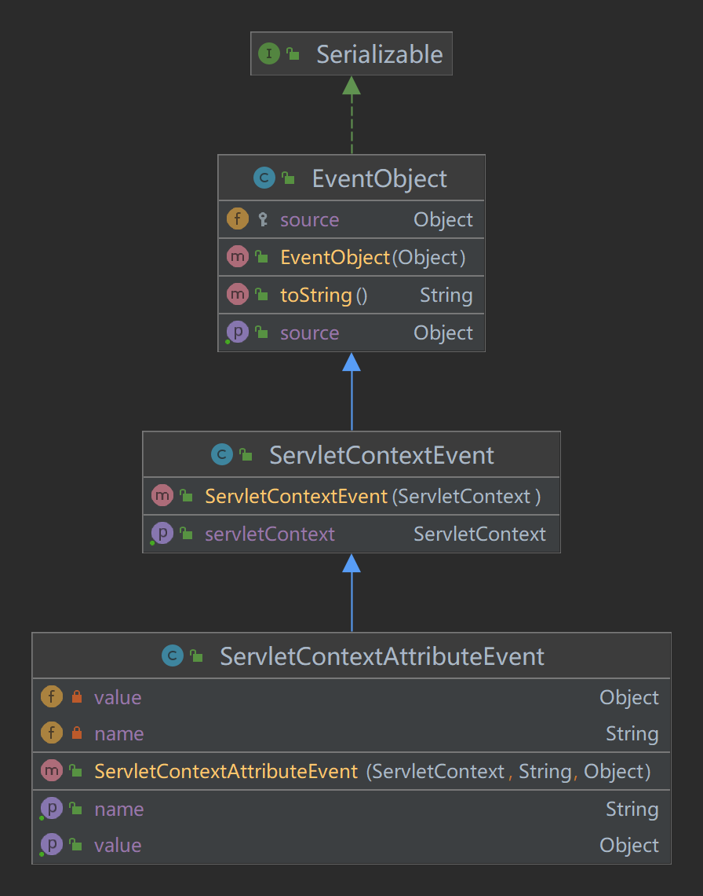
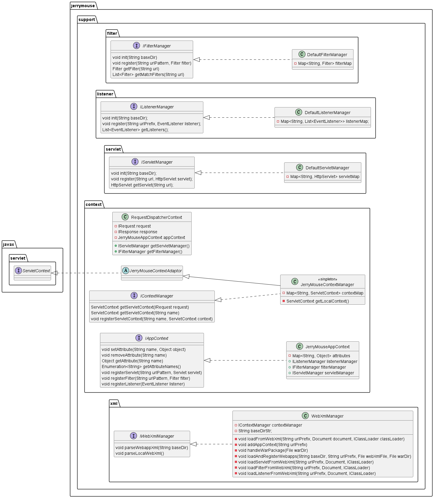
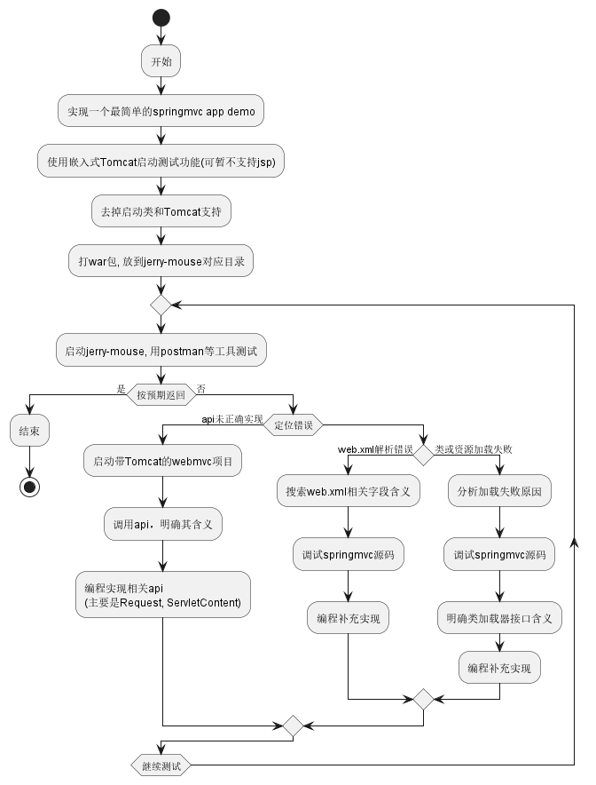
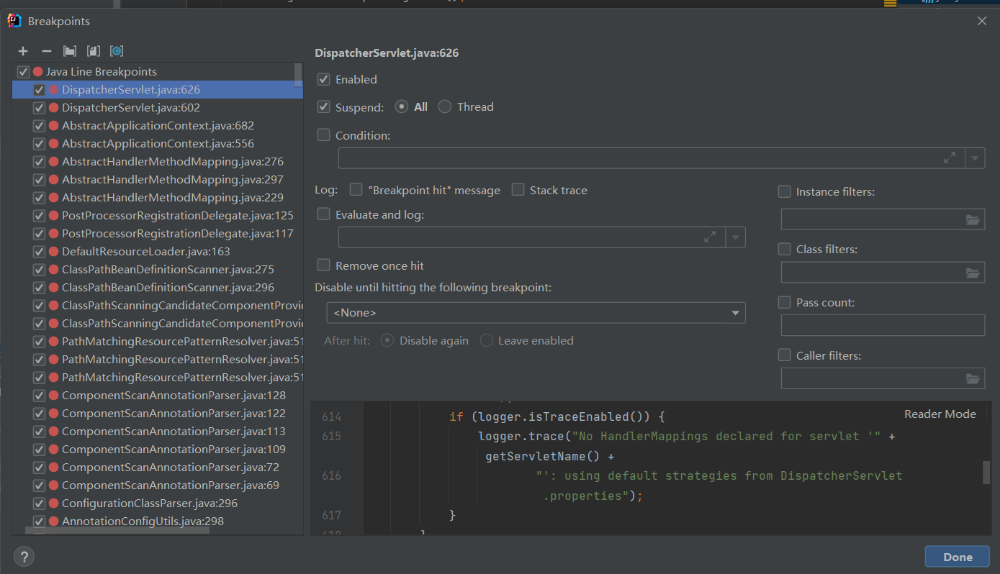

# jerry-mouse
A simplified Tomcat

## step 1: socket 监听

需求:
1、启动一个socket，监听8080端口，返回一个简易符合http协议的信息，在页面上解析结果为
`Hello JerryMouse!

2、提供关闭socket服务的接口stop()

3、测试socket的开启与关闭
`
```java
class JerryMouseBootStrap {
    private static String httpResp(String rawText) {
        String format = "HTTP/1.1 200 OK\r\n" +
                "Content-Type: text/plain\r\n" +
                "\r\n" +
                "%s";
        return String.format(format, rawText);
    }
    // 异步
    public void start() {
        threadPool.execute(() -> {
            startService();
        });
    }
    private void startService() {
        // ...
        while(true)
        {
            Socket socket = serverSocket.accept();
            OutputStream outputStream = socket.getOutputStream();
            outputStream.write(httpResp("Hello JerryMouse!").getBytes());
            socket.close();
        }
        // ...
    }
}
```

注意使用异步方式启动，不要阻塞主线程

测试代码:Main.java

至此，很好理解。

git log: [jerry-mouse] simple socket

## step 2: request, response 封装 与静态html返回

需求
1、将InputStream，OutputStream封装成Request和Response
2、Request对象解析请求，获得url和method
3、将对应路径下的 /index.html返回

```java
public class JerryMouseRequest {
    private static Logger logger = LoggerFactory.getLogger(JerryMouseRequest.class);

    private String method;

    @Getter
    private String url;

    private InputStream inputStream;

    public JerryMouseRequest(InputStream inputStream) {
        this.inputStream = inputStream;
        this.parseInputStream();
    }

    private void parseInputStream() {
        byte[] buffer = new byte[1024]; // 使用固定大小的缓冲区
        int bytesRead = 0;
        try {
            while ((bytesRead = inputStream.read(buffer)) != -1) { // 循环读取数据直到EOF
                String inputStr = new String(buffer, 0, bytesRead);

                // 检查是否读取到完整的HTTP请求行
                if (inputStr.contains("\n")) {
                    // 获取第一行数据
                    String firstLineStr = inputStr.split("\\n")[0];
                    String[] strings = firstLineStr.split(" ");
                    this.method = strings[0];
                    this.url = strings[1];

                    logger.info("[JerryMouse] method={}, url={}", method, url);
                    break; // 退出循环，因为我们已经读取到请求行
                }
            }

            if ("".equals(method)) {
                logger.info("[JerryMouse] No HTTP request line found, ignoring.");
                // 可以选择抛出异常或者返回空请求对象
            }
        } catch (IOException e) {
            logger.error("[JerryMouse] readFromStream meet ex", e);
            throw new JerryMouseException(e);
        }
    }
}

class JerryMouseResponse {
    public JerryMouseResponse(OutputStream outputStream) {
        this.outputStream = outputStream;
    }

    public void write(byte[] bytes) {
        try {
            outputStream.write(bytes);
        } catch (IOException e) {
            logger.error("[JerryMouse] write outputStream meet exception", e);
            throw new JerryMouseException(e);
        }
    }
}
public class JerryMouseBootstrap {
    //...
    public void start() {
        threadPool.execute(() -> {
            startService();
        });
    }

    private void startService() {
        if(runningFlag) {
            logger.warn("[Jerry-mouse] server is already start!");
            return;
        }
        logger.info("[Jerry-mouse] start listen on port {}", port);
        logger.info("[Jerry-mouse] visit url http://{}:{}/index.html", LOCAL_HOST, port);
        try {
            this.serverSocket = new ServerSocket(port);
            runningFlag = true;
            while(runningFlag && !serverSocket.isClosed()) {
                Socket socket = serverSocket.accept();
                JerryMouseRequest request = new JerryMouseRequest(socket.getInputStream());
                JerryMouseResponse response = new JerryMouseResponse(socket.getOutputStream());
                // response.write(httpResp("Hello JerryMouse!").getBytes());
                String staticHtmlPath = request.getUrl(); // null
                // 展示静态html文件
                if(Objects.nonNull(staticHtmlPath) && staticHtmlPath.endsWith(".html")) {
                    String absolutePath = JerryMouseResourceUtils
                            .buildFullPath(JerryMouseResourceUtils
                                            .getClassRootResource(JerryMouseBootstrap.class)
                                    , staticHtmlPath);
                    String content = JerryMouseFileUtils.getFileContent(absolutePath);
                    logger.info("[JerryMouse] static html path: {}, content={}", absolutePath, content);
                    String html = JerryMouseHttpUtils.http200Resp(content);
                    response.write(html);
                }
                else {
                    String html = JerryMouseHttpUtils.http404Resp();
                    response.write(html);
                }
                socket.close();
            }
        } catch (IOException e) {
            logger.error("[JerryMouse] meet ex", e);
            throw new JerryMouseException(e);
        }
    }
}

```

测试：
```java
public class Main {
    public static void main(String[] args){
        JerryMouseBootstrap bootstrap = new JerryMouseBootstrap();
        bootstrap.start();
    }
}
```
http://127.0.0.1:8080/index.html GET

预计返回：Jerry Mouse index html

需要先mvn clean install， 将index.html 放到target中

注意读取inputStream时，不要使用inputStream.available()， 因为网络数据可能分批到达，实测不能正确读取。

按照现有代码，可以正确读取。

根据路径获得本地资源时，注意区分windows和linux，会有所区别

至此，发现request和response，就是对inputStream和outputStream的一个封装

解析inputStream的内容（也就是http请求），获得url, method等参数
根据url，获取对应的html资源返回。

git log: [jerry-mouse] request, response and static html

## 3、servlet
需求分析与背景：
以上仅仅能够返回静态页面。更多时候我们需要返回接口数据，需要服务端处理判断
这时候需要servlet
所谓servlet，就是根据request，对response操作，返回页面或者数据
Servlet 直接处理 HTTP 请求，通过 doGet、doPost 等方法对不同类型的请求进行响应。

Servlet主要接口
```java
public abstract class AbstractJerryMouseServlet extends HttpServlet {

    protected abstract void doGet(HttpServletRequest req, HttpServletResponse resp);

    protected  abstract void doPost(HttpServletRequest req, HttpServletResponse resp);

    @Override
    protected void service(HttpServletRequest req, HttpServletResponse resp){
        if(JerryMouseHttpMethodType.GET.getCode().equalsIgnoreCase(req.getMethod())) {
            this.doGet(req, resp);
            return;
        }

        this.doPost(req, resp);
    }
}
```
再贴一个默认的service实现，就是这么简单
```java
public abstract class HttpServlet extends GenericServlet {
    protected void service(HttpServletRequest req, HttpServletResponse resp) throws ServletException, IOException {
        String method = req.getMethod();
        long lastModified;
        if (method.equals("GET")) {
            lastModified = this.getLastModified(req);
            if (lastModified == -1L) {
                this.doGet(req, resp);
            } else {
                long ifModifiedSince = req.getDateHeader("If-Modified-Since");
                if (ifModifiedSince < lastModified) {
                    this.maybeSetLastModified(resp, lastModified);
                    this.doGet(req, resp);
                } else {
                    resp.setStatus(304);
                }
            }
        } else if (method.equals("HEAD")) {
            lastModified = this.getLastModified(req);
            this.maybeSetLastModified(resp, lastModified);
            this.doHead(req, resp);
        } else if (method.equals("POST")) {
            this.doPost(req, resp);
        } else if (method.equals("PUT")) {
            this.doPut(req, resp);
        } else if (method.equals("DELETE")) {
            this.doDelete(req, resp);
        } else if (method.equals("OPTIONS")) {
            this.doOptions(req, resp);
        } else if (method.equals("TRACE")) {
            this.doTrace(req, resp);
        } else {
            String errMsg = lStrings.getString("http.method_not_implemented");
            Object[] errArgs = new Object[]{method};
            errMsg = MessageFormat.format(errMsg, errArgs);
            resp.sendError(501, errMsg);
        }
    }
}
```
service 在servlet对应url被访问时调用
那么，如何获得url和servlet的映射关系？这是Tomcat(Servlet容器)的功能，也就是本次需要模仿实现的功能
需要实现一个manager, 实现下面两个接口
```java
public interface IServletManager {
    /**
     * 注册 servlet
     *
     * @param url     url
     * @param servlet servlet
     */
    void register(String url, HttpServlet servlet);

    /**
     * 获取 servlet
     *
     * @param url url
     * @return servlet
     */
    HttpServlet getServlet(String url);
}
```
目前使用web.xml的方式管理，格式形如

```xml
<?xml version="1.0" encoding="UTF-8"?>
<web-app version="2.4"
         xmlns="http://java.sun.com/xml/ns/j2ee"
         xmlns:xsi="http://www.w3.org/2001/XMLSchema-instance"
         xsi:schemaLocation="http://java.sun.com/xml/ns/j2ee http://java.sun.com/xml/ns/j2ee/web-app_2_4.xsd">

    <servlet>
        <servlet-name>test</servlet-name>
        <servlet-class>com.github.ljl.jerrymouse.apps.servlet.JerryMouseHttpTestServlet</servlet-class>
    </servlet>

    <servlet-mapping>
        <servlet-name>test</servlet-name>
        <url-pattern>/test</url-pattern>
    </servlet-mapping>

    <servlet>
        <servlet-name>test2</servlet-name>
        <servlet-class>com.github.ljl.jerrymouse.apps.servlet.JerryMouseHttpTest2Servlet</servlet-class>
    </servlet>

    <servlet-mapping>
        <servlet-name>test2</servlet-name>
        <url-pattern>/test2</url-pattern>
    </servlet-mapping>
</web-app>
```

不难想到，可以使用map存储url-servlet映射，作为公共基类，在这里使用组合而不是继承的方式
```java
public class DefaultServletManager implements IServletManager{

    private static Logger logger = LoggerFactory.getLogger(DefaultServletManager.class);

    protected final Map<String, HttpServlet> servletMap = new HashMap<>();

    @Override
    public void register(String url, HttpServlet servlet) {
        logger.info("[JerryMouse] register servlet, url={}, servlet={}", url, servlet.getClass().getName());
        servletMap.put(url, servlet);
    }

    @Override
    public HttpServlet getServlet(String url) {
        return servletMap.get(url);
    }
}
```
并在启动时加载一次web.xml文件，存储在内存
```java
public class WebXmlServletManager implements IServletManager {

    private static Logger logger = LoggerFactory.getLogger(JerryMouseHttpTestServlet.class);

    private IServletManager manager = new DefaultServletManager();

    public WebXmlServletManager() {
        this.loadFromWebXml();
    }

    /**
     * 1. 解析 web.xml
     * 2. 读取对应的 servlet mapping
     * 3. 保存对应的 url + servlet 示例到 servletMap
     */
    private synchronized void loadFromWebXml() {
        // 加载web.xml文件
        this.register(urlPattern, httpServlet);
    }
    @Override
    public void register(String url, HttpServlet servlet) {
        manager.register(url, servlet);
    }

    @Override
    public HttpServlet getServlet(String url) {
        return manager.getServlet(url);
    }
}
```
工具类`WebXmlServletManager` 目前在主程序中初始化一次即可，不会手动调用

如此完成了url-servlet的映射

主流程
```java

/**
 * 对request, response, servletManager的封装
 */
@Data
public class RequestDispatcherContext {

    private JerryMouseRequest request;

    private JerryMouseResponse response;

    // 提供根据url获取Servlet的接口
    private IServletManager servletManager;
}
```
``` java
public class JerryMouseBootstrap {
    public void startService() {
        //...
        while(runningFlag && !serverSocket.isClosed()) {
            try (Socket socket = serverSocket.accept();){
                JerryMouseRequest request = new JerryMouseRequest(socket.getInputStream());
                JerryMouseResponse response = new JerryMouseResponse(socket.getOutputStream());

                // 分发处理
                final RequestDispatcherContext dispatcherContext = new RequestDispatcherContext();
                dispatcherContext.setRequest(request);
                dispatcherContext.setResponse(response);
                dispatcherContext.setServletManager(servletManager);
                this.requestDispatcher.dispatch(dispatcherContext);
                // socket.close();
            } catch (IOException e) {
                logger.error("[JerryMouse] meet exception {}", e);
            }
        }
    }
}
```

`RequestDispatcherManager` 相当于前端控制器，这里关注`servletRequestDispatcher
另两种顾名思义，返回空页面和静态页面，用于测试

```java
public class RequestDispatcherManager implements IRequestDispatcher {

    private final IRequestDispatcher emptyRequestDispatcher = new EmptyRequestDispatcher();
    private final IRequestDispatcher staticHtmlRequestDispatcher = new StaticHtmlRequestDispatcher();
    private final IRequestDispatcher servletRequestDispatcher = new ServletRequestDispatcher();

    @Override
    public void dispatch(RequestDispatcherContext context) {
        final JerryMouseRequest request = context.getRequest();
        // 分发
        String requestUrl = request.getUrl();
        if (StringUtil.isEmpty(requestUrl)) {
            emptyRequestDispatcher.dispatch(context);
        } else {
            if (requestUrl.endsWith(".html")) {
                staticHtmlRequestDispatcher.dispatch(context);
            } else {
                servletRequestDispatcher.dispatch(context);
            }
        }
    }
}
```

```java
public class ServletRequestDispatcher implements IRequestDispatcher {
    private static Logger logger = LoggerFactory.getLogger(ServletRequestDispatcher.class);

    @Override
    public void dispatch(RequestDispatcherContext context) {
        JerryMouseRequest request = context.getRequest();
        JerryMouseResponse response = context.getResponse();
        IServletManager servletManager = context.getServletManager();

        // 直接和 servlet 映射
        String requestUrl = request.getUrl();
        // 此处用到了之前注册的url-servlet
        HttpServlet httpServlet = servletManager.getServlet(requestUrl);
        if(Objects.isNull(httpServlet)) {
            logger.warn("[JerryMouse] requestUrl={} mapping not found", requestUrl);
            response.write(JerryMouseHttpUtils.http404Resp());
        } else {
            // 正常的逻辑处理
            try {
                // 用到了策略模式
                httpServlet.service(request, response);
            } catch (Exception e) {
                logger.error("[JerryMouse] http servlet handle meet ex", e);
                throw new JerryMouseException(e);
            }
        }
    }
}
```

如此，`httpServlet.service(request, response)` 后，一次调用完成

回顾调用链

1、容器初始化

1.1 socket监听8080端口

1.2 初始化WebXmlServletManager，扫描web.xml, 存储url-servlet map

1.3 初始化RequestDispatcherManager，用于之后分发请求，选择使用静态页面还是servlet

1.4 初始化ServletRequestDispatcher，用于分配到不同的servlet

2、发送一个请求

2.1 通过socket获得InputStream和OutputStream，存放到context

2.2 RequestDispatcherManager通过context获得request，根据url判断
是请求静态页面还是servlet

2.3 如请求servlet， ServletRequestDispatcher 负责分发，从context中获取初始化的
ServletManager(此处即WebXmlServletManager)，通过接口getServlet(url) 获取对应servlet

2.4 获取到的servlet.service(request, response); 其中自己实现的servlet需要继承HttpServlet

2.5 在service()中调用对应的doGet()或者doPost(), response.write()返回内容

```
"pool-1-thread-1@1208" prio=5 tid=0xd nid=NA runnable
  java.lang.Thread.State: RUNNABLE
	  at com.github.ljl.jerrymouse.servlet.JerryMouseHttpTestServlet.doGet(JerryMouseHttpTestServlet.java:25)
	  at com.github.ljl.jerrymouse.servlet.AbstractJerryMouseServlet.service(AbstractJerryMouseServlet.java:27)
	  at javax.servlet.http.HttpServlet.service(HttpServlet.java:750)
	  at com.github.ljl.jerrymouse.dispatcher.ServletRequestDispatcher.dispatch(ServletRequestDispatcher.java:41)
	  at com.github.ljl.jerrymouse.dispatcher.RequestDispatcherManager.dispatch(RequestDispatcherManager.java:32)
	  at com.github.ljl.jerrymouse.bootstrap.JerryMouseBootstrap.startService(JerryMouseBootstrap.java:95)
	  at com.github.ljl.jerrymouse.bootstrap.JerryMouseBootstrap.lambda$start$0(JerryMouseBootstrap.java:69)
	  at com.github.ljl.jerrymouse.bootstrap.JerryMouseBootstrap$$Lambda$1.345281752.run(Unknown Source:-1)
	  at java.util.concurrent.ThreadPoolExecutor.runWorker(ThreadPoolExecutor.java:1149)
	  at java.util.concurrent.ThreadPoolExecutor$Worker.run(ThreadPoolExecutor.java:624)
	  at java.lang.Thread.run(Thread.java:748)
```
补充说明

httpServlet.service(request, response)要求request和response，实现HttpServletRequest和HttpServletResponse接口
然而，我们自己封装的简易request，response并没有实现接口中的所有方法, 不能过编译
下面以Request为例说明处理方法：

可以使用适配器模式，新建一个RequestAdaptor抽象类，实现HttpRequest的暂时不需要使用的接口
仅需要默认实现，通过编译，不需要具体功能。而我们的Request只需要实现类似getMethod这样的，
被其他模块用到的方法。

其他多余的接口，目前并不打算用到，因此可以都先改为抛异常。

Request继承Adaptor，实现getMethod等已经使用到的方法。



当然也可以使用组合的方式

至此，已经完成了最mini版本的servlet容器

测试：

```bash
mvn clean
mvn install

启动Main

# 使用postman等工具测试
> GET http://127.0.0.1:8080/test
JerryMouseHttpTestServlet-get
> POST http://127.0.0.1:8080/test
JerryMouseHttpTestServlet-post
> GET http://127.0.0.1:8080/test2
JerryMouseHttpTestServlet2-get
> GET http://127.0.0.1:8080/test3
404 Not Found: The requested resource was not found on this server.
> GET http://127.0.0.1:8080/index.html
Jerry Mouse index html
> GET http://127.0.0.1:8080/1.html
1 html
> GET http://127.0.0.1:8080/2.html
404 Not Found: The requested resource was not found on this server.

```

记为0.3版本

[uml](./uml/jerrymouse_v0.3.puml)

参考文献：[houbb 从零手写实现 tomcat](https://houbb.github.io/2016/11/07/web-server-tomcat-05-hand-write-servlet-web-xml)

## step 4、nio netty
需求：bootstrap中的socket目前用的是最简单的bio，会阻塞
要求改为nio
分别完成手写nio和使用netty框架两个版本
将旧版实现改为JerryMouseBootstrapBio, 用作复习

nio 代码，此处有遗留问题 TODO
```java
class JerryMouseBootStrap {
    private void startService() {
        try {
            serverSocketChannel = ServerSocketChannel.open();
            serverSocketChannel.bind(new InetSocketAddress(port));
            serverSocketChannel.configureBlocking(false);

            selector = Selector.open();
            serverSocketChannel.register(selector, SelectionKey.OP_ACCEPT);

            while (true) {
                int readyChannels = selector.select();
                if (readyChannels == 0) {
                    continue;
                }

                Set<SelectionKey> selectedKeys = selector.selectedKeys();
                Iterator<SelectionKey> keyIterator = selectedKeys.iterator();

                while (keyIterator.hasNext()) {
                    SelectionKey key = keyIterator.next();
                    keyIterator.remove();
                    if (key.isAcceptable()) {
                        handleAccept(key);
                    } else if (key.isReadable()) {
                        handleRead(key);
                    }
                }
            }
        } catch (IOException e) {
            logger.error("[JerryMouse] start meet exception {}", e);
            throw new JerryMouseException(e);
        }
    }
    private void handleAccept(SelectionKey key) throws IOException {
        ServerSocketChannel serverSocketChannel = (ServerSocketChannel) key.channel();
        SocketChannel socketChannel = serverSocketChannel.accept();
        socketChannel.configureBlocking(false);
        socketChannel.register(key.selector(), SelectionKey.OP_READ);
    }

    private void handleRead(SelectionKey key) {
        // TODO: 异步执行会有问题
        // threadPool.execute(() -> {
            SocketChannel clientChannel = (SocketChannel) key.channel();
            if (!clientChannel.isOpen()) {
                return;
            }
            try {
                JerryMouseRequest request = new JerryMouseRequest(clientChannel);
                JerryMouseResponse response = new JerryMouseResponse(clientChannel);
                RequestDispatcherContext dispatcherContext = new RequestDispatcherContext();
                dispatcherContext.setRequest(request);
                dispatcherContext.setResponse(response);
                dispatcherContext.setServletManager(servletManager);
                requestDispatcher.dispatch(dispatcherContext);
            } finally {
                try {
                    if (clientChannel.isOpen()) {
                        key.interestOps(key.interestOps() | SelectionKey.OP_READ);
                        key.selector().wakeup(); // 确保selector从阻塞状态返回
                    } else {
                        key.cancel();
                    }
                } catch (CancelledKeyException e) {
                    logger.error("Key has been cancelled", e);
                }
            }
        // });
    }
}

public class JerryMouseRequest extends JerryMouseRequestAdaptor {
    // 省略部分字段和接口
    public JerryMouseRequest(SocketChannel socketChannel) {
        this.socketChannel = socketChannel;
        parseSocketChannel();
    }

    private void parseSocketChannel() {
        StringBuilder requestBuffer = new StringBuilder(); // 缓存部分数据
        ByteBuffer buffer = ByteBuffer.allocate(1024); // 使用固定大小的缓冲区
        int bytesRead;
        try {
            while ((bytesRead = socketChannel.read(buffer)) > 0) {
                buffer.flip();
                byte[] data = new byte[buffer.remaining()];
                buffer.get(data);
                requestBuffer.append(new String(data));
                buffer.clear();

                // 检查是否读取到完整的HTTP请求行
                if (requestBuffer.toString().contains("\n")) {
                    // 获取第一行数据
                    String firstLineStr = requestBuffer.toString().split("\\n")[0];
                    String[] strings = firstLineStr.split(" ");
                    this.method = strings[0];
                    this.url = strings[1];

                    logger.info("[JerryMouse] method={}, url={}", method, url);
                    break; // 退出循环，因为我们已经读取到请求行
                }
            }
        } catch (IOException e) {
            logger.error("[JerryMouse] meet exception");
            throw new JerryMouseException(e);
        }


        if ("".equals(method)) {
            logger.info("[JerryMouse] No HTTP request line found, ignoring.");
            // 可以选择抛出异常或者返回空请求对象
        }

        if (bytesRead <= 0) {
            try {
                socketChannel.close();
            } catch (IOException e) {
                e.printStackTrace();
            }
        }
    }
}

public class JerryMouseResponse extends JerryMouseResponseAdaptor {
    private static Logger logger = LoggerFactory.getLogger(JerryMouseBootstrap.class);

    private SocketChannel clientChannel;

    public JerryMouseResponse(SocketChannel clientChannel) {
        this.clientChannel = clientChannel;
    }

    public void write(String data){
        ByteBuffer buffer = ByteBuffer.wrap(data.getBytes());
        while (buffer.hasRemaining()) {
            try {
                clientChannel.write(buffer);
                // 这句不能省略
                clientChannel.close();
            }
            catch (IOException e) {
                logger.error("[JerryMouse] meet exception");
                throw new JerryMouseException(e);
            }
        }
    }
}
```

区别在于，使用SocketChannel，而不是直接使用InputStream

git log：[jerry-mouse] 4.1.1-nio 

## 4.2 netty

netty框架是
```java

```
核心组件(回答来自chatgpt)
- Channel：Netty 用于网络 I/O 操作的基本抽象，表示一个打开的连接，如 TCP 连接、文件等。通过 Channel 可以进行数据的读写操作。
EventLoop

- EventLoop：一个处理 I/O 操作的单线程执行器，每个 EventLoop 负责一个或多个 Channel 的 I/O 操作。EventLoopGroup 是 EventLoop 的集合，通常用于管理一组 EventLoop。
ChannelHandler

- ChannelHandler：是处理 I/O 事件的回调接口，可以实现自定义的业务逻辑，如编码、解码、业务处理等。
ChannelPipeline

- ChannelPipeline：是 ChannelHandler 的链，管理着 ChannelHandler 的调用顺序。每个 Channel 都有一个独立的 ChannelPipeline。
Bootstrap 和 ServerBootstrap：

这两个类用于引导客户端和服务器，配置各种参数并启动应用。

使用方法 代码欣赏一下，主要是重写channelRead
```java
class JerryMouseBootStrap
{
    public void startService() {
        logger.info("[JerryMouse] start listen on port {}", port);
        logger.info("[JerryMouse] visit url http://{}:{}", LOCAL_HOST, port);

        EventLoopGroup bossGroup = new NioEventLoopGroup();
        //worker 线程池的数量默认为 CPU 核心数的两倍
        EventLoopGroup workerGroup = new NioEventLoopGroup();

        try {
            ServerBootstrap serverBootstrap = new ServerBootstrap();
            serverBootstrap.group(bossGroup, workerGroup)
                    .channel(NioServerSocketChannel.class)
                    .childHandler(new ChannelInitializer<SocketChannel>() {
                        @Override
                        protected void initChannel(SocketChannel ch) {
                            ch.pipeline().addLast(new JerryMouseServerHandler());
                        }
                    })
                    .option(ChannelOption.SO_BACKLOG, 128)
                    .childOption(ChannelOption.SO_KEEPALIVE, true);

            // Bind and start to accept incoming connections.
            ChannelFuture future = serverBootstrap.bind(port).sync();

            // Wait until the server socket is closed.
            future.channel().closeFuture().sync();
            logger.info("DONE");
        } catch (InterruptedException e) {
            logger.error("JerryMouse start meet exception");
            throw new JerryMouseException(e);
        } finally {
            workerGroup.shutdownGracefully();
            bossGroup.shutdownGracefully();
        }
    }
}
public class JerryMouseServerHandler extends ChannelInboundHandlerAdapter {
    private static Logger logger = LoggerFactory.getLogger(JerryMouseRequestUtils.class);

    /**
     * servlet 管理
     *
     * @since 0.3.0
     */
    private final IServletManager servletManager = new WebXmlServletManager();

    /**
     * 请求分发
     *
     * @since 0.3.0
     */
    private final IRequestDispatcher requestDispatcher = new RequestDispatcherManager();

    @Override
    public void channelRead(ChannelHandlerContext context, Object msg) throws Exception {
        ByteBuf buf = (ByteBuf) msg;
        byte[] bytes = new byte[buf.readableBytes()];
        buf.readBytes(bytes);
        String requestString = new String(bytes, Charset.defaultCharset());
        logger.info("[JerryMouse] channelRead requestString={}", requestString);


        // 获取请求信息
        RequestInfoBo requestInfoBo = JerryMouseRequestUtils.buildRequestInfoBo(requestString);
        IRequest request = new JerryMouseRequest(requestInfoBo.getMethod(), requestInfoBo.getUrl());
        IResponse response = new JerryMouseResponse(context);

        // 分发调用
        final RequestDispatcherContext dispatcherContext = new RequestDispatcherContext();
        dispatcherContext.setRequest(request);
        dispatcherContext.setResponse(response);
        dispatcherContext.setServletManager(servletManager);
        requestDispatcher.dispatch(dispatcherContext);
    }

    @Override
    public void channelReadComplete(ChannelHandlerContext context) throws Exception {
        context.flush();
    }

    @Override
    public void exceptionCaught(ChannelHandlerContext context, Throwable cause) throws Exception {
        logger.error("JerryMouseServerHandler cause exception ", cause);
        context.close();
    }
}

```
channelRead调用栈
```
"nioEventLoopGroup-3-1@1842" prio=10 tid=0xf nid=NA runnable
  java.lang.Thread.State: RUNNABLE
	  at com.github.ljl.jerrymouse.bootstrap.JerryMouseServerHandler.channelRead(JerryMouseServerHandler.java:49)
	  at io.netty.channel.AbstractChannelHandlerContext.invokeChannelRead(AbstractChannelHandlerContext.java:444)
	  at io.netty.channel.AbstractChannelHandlerContext.invokeChannelRead(AbstractChannelHandlerContext.java:420)
	  at io.netty.channel.AbstractChannelHandlerContext.fireChannelRead(AbstractChannelHandlerContext.java:412)
	  at io.netty.channel.DefaultChannelPipeline$HeadContext.channelRead(DefaultChannelPipeline.java:1410)
	  at io.netty.channel.AbstractChannelHandlerContext.invokeChannelRead(AbstractChannelHandlerContext.java:440)
	  at io.netty.channel.AbstractChannelHandlerContext.invokeChannelRead(AbstractChannelHandlerContext.java:420)
	  at io.netty.channel.DefaultChannelPipeline.fireChannelRead(DefaultChannelPipeline.java:919)
	  at io.netty.channel.nio.AbstractNioByteChannel$NioByteUnsafe.read(AbstractNioByteChannel.java:166)
	  at io.netty.channel.nio.NioEventLoop.processSelectedKey(NioEventLoop.java:788)
	  at io.netty.channel.nio.NioEventLoop.processSelectedKeysOptimized(NioEventLoop.java:724)
	  at io.netty.channel.nio.NioEventLoop.processSelectedKeys(NioEventLoop.java:650)
	  at io.netty.channel.nio.NioEventLoop.run(NioEventLoop.java:562)
	  at io.netty.util.concurrent.SingleThreadEventExecutor$4.run(SingleThreadEventExecutor.java:997)
	  at io.netty.util.internal.ThreadExecutorMap$2.run(ThreadExecutorMap.java:74)
	  at io.netty.util.concurrent.FastThreadLocalRunnable.run(FastThreadLocalRunnable.java:30)
	  at java.lang.Thread.run(Thread.java:748)

```
// TODO: netty内部源码分析

架构修改：
request和response，实际需要的是一些接口，例如getMethod，getUrl
因此加一层接口，以request为例
```java
public interface IRequest extends HttpServletRequest {
    /**
     * 获取请求地址
     * @return url
     */
    String getUrl();

    /**
     * 获取方法
     * @return method
     */
    String getMethod();
}
public abstract class JerryMouseRequestAdaptor implements IRequest {
    // 代码略
}
@Data
@AllArgsConstructor
public class JerryMouseRequest extends JerryMouseRequestAdaptor {
    private static Logger logger = LoggerFactory.getLogger(JerryMouseRequest.class);

    private String method;

    private String url;
}
```
并以接口的形式使用

删除了旧版代码

[uml v0.4.2](./uml/jerrymouse_v0.4.2.puml)

测试方式相同，功能测试正常

// TODO：性能测试

记为0.4.2

git log: [jerrymouse] 0.4.2-using netty

tag: v0.4.2

## 5、解析war包 类加载（难点）
需求：
目前仅加载自己写的servlet，现在要求能解析处理其他war包

新建一个web-demo项目，写一个IndexServlet，并打包
```
mvn clean install
```
生成 web-demo目录 和 web-demo.war

根据类路径（非当前项目）加载类信息

问题: 测试servlet代码如下
```java
public class IndexServlet extends HttpServlet {
    public IndexServlet() {
    }
    protected void doGet(HttpServletRequest req, HttpServletResponse resp) throws ServletException, IOException {
        PrintWriter out = resp.getWriter(); // null 
        resp.setContentType("text/html");
        out.println("<h1>servlet index get</h1>");
    }

    protected void doPost(HttpServletRequest req, HttpServletResponse resp) throws ServletException, IOException {
        resp.setContentType("text/html");
        PrintWriter out = resp.getWriter();
        out.println("<h1>servlet index post</h1>");
    }
}
```
继承HttpServlet
但本次测试的Servlet逻辑自己实现。

而JerryMouse服务器，和IndexServlet的公共接口，只有HttpServlet

但实际上，JerryMouseResponse根本没有实现完整的HttpServlet，而是使用适配器

JerryMouseResponseAdaptor蒙混过关
适配器中，没有正确实现resp.getWriter()或者getOutputStream()接口
（而是无效接口，再次体会一下接口，协议的作用）
因此没法进行

目前IndexServlet只能基于HttpServlet的接口，而内部的Servlet是这样写的
```java
public class JerryMouseHttpTestServlet extends AbstractJerryMouseServlet {

    private static Logger logger = LoggerFactory.getLogger(JerryMouseHttpTestServlet.class);

    @Override
    protected void doGet(HttpServletRequest req, HttpServletResponse resp) {
        String content = "JerryMouseHttpTestServlet-get";

        JerryMouseResponse response = (JerryMouseResponse) resp;
        response.write(JerryMouseHttpUtils.http200Resp(content));
    }

    @Override
    protected void doPost(HttpServletRequest req, HttpServletResponse resp) {
        String content = "JerryMouseHttpTestServlet-post";

        JerryMouseResponse response = (JerryMouseResponse) resp;
        response.write(JerryMouseHttpUtils.http200Resp(content));
    }
}
```

因此，Servlet需要持有JerryMouseResponse的引用。。。吗？引入相关的库？
有种立即见效的方式，就是使用反射强行调用。。。你就说能不能用吧

```java
public class IndexServlet extends HttpServlet {
    @Override
    protected void doGet(HttpServletRequest req, HttpServletResponse resp) throws ServletException, IOException {
        resp.setContentType("text/html");
        writeToResponse(resp,"servlet index get");
    }
    @Override
    protected void doPost(HttpServletRequest req, HttpServletResponse resp) throws ServletException, IOException {
        resp.setContentType("text/html");
        writeToResponse(resp,"servlet index post");
    }
    private void writeToResponse(HttpServletResponse resp, String content) {
        try {
            Class<?> responseClass = resp.getClass();
            Method writeMethod = responseClass.getMethod("write", String.class);
            writeMethod.invoke(resp, IndexServlet.http200Resp(content));
        } catch (Exception e) {
            e.printStackTrace();
        }
    }
    public static String http200Resp(String rawText) {
        String format = "HTTP/1.1 200 OK\r\n" +
                "Content-Type: text/plain\r\n" +
                "\r\n" +
                "%s";

        return String.format(format, rawText);
    }
}
```

好！下面进行测试

```bash
# project web-demo
mvn clean install
将web-demo.war包放到jerry-mouse项目的test/webapps下
# project jerry-mouse
根据项目所在位置,修改 com.github.ljl.Main 中的 baseWarDir
mvn clean install

启动 com.github.ljl.Main

# 功能测试
> GET http://127.0.0.1:8080/web-demo/index
servlet index get
> POST http://127.0.0.1:8080/web-demo/index
servlet index post
> GET http://127.0.0.1:8080/test
JerryMouseHttpTestServlet-get
> POST http://127.0.0.1:8080/test
JerryMouseHttpTestServlet-post
> POST http://127.0.0.1:8080/test2
JerryMouseHttpTestServlet2-post
> GET http://127.0.0.1:8080/index.html
Jerry Mouse index html
```

```bash
git log:
jerry-mouse:  [jerry-mouse] v0.5.0 load-other-webapp
web-demo:     [web-demo] v0.5.0 load-other-webapp
```

## 5.2 适配HttpServlet
现在，我们写这么一个servlet
```java
public class JerryMouseHttpServlet extends HttpServlet {
    private static Logger logger = LoggerFactory.getLogger(JerryMouseHttpServlet.class);

    @Override
    protected void doGet(HttpServletRequest req, HttpServletResponse resp) {
        String content = "HttpServlet-get using stream";
        resp.setContentType("text/html");
        try {
            ServletOutputStream outputStream = resp.getOutputStream();
            outputStream.print(JerryMouseHttpUtils.http200Resp(content));
            resp.flushBuffer();
        } catch (IOException e) {
            e.printStackTrace();
        }
    }

    @Override
    protected void doPost(HttpServletRequest req, HttpServletResponse resp){
        String content = "HttpServlet-post using writer";
        resp.setContentType("text/html");
        try {
            PrintWriter writer = resp.getWriter();
            writer.print(JerryMouseHttpUtils.http200Resp(content));
            resp.flushBuffer();
        } catch (IOException e) {
            e.printStackTrace();
        }
    }
}
```
直接扩展HttpServlet，并不直接使用JerryMouseResponse的write()接口，可以正常运行吗？

编译运行没有问题，但结果不对

这里使用了resp.getOutputStream()和resp.getWriter()，以及resp.flushBuffer()接口，用于写回数据
入参是HttpServletResponse类型，而这只是一个接口！

实现类在哪里？这不是自己已经实现的JerryMouseResponse，回顾一下代码逻辑
```java
public class ServletRequestDispatcher implements IRequestDispatcher {
    @Override
    public void dispatch(RequestDispatcherContext context) {
        IRequest request = context.getRequest();
        IResponse response = context.getResponse();
        IServletManager servletManager = context.getServletManager();
        HttpServlet httpServlet = servletManager.getServlet(request.getUrl());
        // 省略判空以及异常处理
        httpServlet.service(request, response);
    }
}
```

启动时，扫描web.xml注册servlet，也就是此处的httpServlet即为JerryMouseHttpServlet类型
直接扩展自HttpServlet,因此默认的HttpServlet::service(), 根据Method转到doGet或者doPost等
（前面的很多Servlet扩展自AbstractJerryMouseServlet，里面重写了service，注意区别）

以GET方法为例，转到JerryMouseHttpServlet的doGet，我们关注request和response是从哪里得到的

从自行封装的RequestDispatcherContext中得到，因此是自己写的JerryMouseResponse类型

而我们目前仅仅用Adaptor蒙混过关（返回空），并没有真正重写getWrite()以及getOutputStream()方法

因此肯定get不出来。而为什么前面的servlet可以运行？是因为使用了JerryMouseResponse的write()，而不是直接使用HttpServlet的一些接口

所以是否要自己写HttpServlet的相关接口

需要

我们为什么用Tomcat可以把servlet跑起来？就是因为Tomcat实现了这些接口

这能让servlet的编写者，在浑然不觉的情况下，编写servlet，放到tomcat中运行

[Tomcat ResponseFacade 实现](https://github.com/apache/tomcat/blob/main/java/org/apache/catalina/connector/ResponseFacade.java)

此处再次体会接口，协议的含义

所以现在可以体会到Tomcat是干啥用的了

我们这次想做的，是让一个遵循HttpServlet接口协议的servlet，放到JerryMouse上，可以正常运行，就行放到Tomcat上一样！

HttpServlet接口非常多， 本次只实现getOutputStream和getWrite，让上面的JerryMouseHttpServlet可以正常运行。

我们在JerryMouseResponse中，放入一个adaptor，代理执行

```java
public class JerryMouseResponse extends AbstractResponse {
    private static Logger logger = LoggerFactory.getLogger(JerryMouseResponse.class);

    private final ChannelHandlerContext context;

    private final HttpServletResponse helper;

    public JerryMouseResponse(ChannelHandlerContext context) {
        this.context = context;
        helper = new JerryMouseResponseHelper(this);
    }
    @Override
    public void write(String text, String charsetStr) {
        Charset charset = Charset.forName(charsetStr);
        ByteBuf responseBuf = Unpooled.copiedBuffer(text, charset);
        context.writeAndFlush(responseBuf)
                .addListener(ChannelFutureListener.CLOSE); // Close the channel after sending the response
        logger.info("[JerryMouse] channelRead writeAndFlush DONE");
    }

    @Override
    public PrintWriter getWriter() throws IOException {
        return helper.getWriter();
    }

    @Override
    public ServletOutputStream getOutputStream() throws IOException {
        return helper.getOutputStream();
    }

    @Override
    public void flushBuffer() throws IOException {
        helper.flushBuffer();
    }
}

/**
 * Helper类，省去了HttpServletResponse中部分暂时用不到接口的默认实现
 */
public class JerryMouseResponseHelper implements HttpServletResponse {

    private JerryMouseResponse response;
    private StringWriter stringWriter;
    private PrintWriter writer;
    /**
     * 采用ByteArrayServletOutputStream
     * 若采用OutputStreamHelper(response)，则复用JerryMouseRequest.write()
     * 两者均可正常运行
     */
    private final ServletOutputStream outputStream;

    public JerryMouseResponseHelper(JerryMouseResponse response) {
        this.response = response;
        this.stringWriter = new StringWriter();
        this.writer = new PrintWriter(stringWriter);
        this.outputStream = new ByteArrayServletOutputStream();
        // this.outputStream = new OutputStreamHelper(response);
    }

    @Override
    public ServletOutputStream getOutputStream() throws IOException {
        return outputStream;
    }

    /**
     * @return PrintWriter
     * @since 0.5.1
     */
    @Override
    public PrintWriter getWriter() {
        return writer;
    }

    @Override
    public void flushBuffer() {
        writer.flush();
        outputStream.flush();

        String writerContent = stringWriter.toString();
        if (!writerContent.isEmpty()) {
            response.write(writerContent, "UTF-8");
        }

        byte[] outputStreamContent = new byte[0];
        if (outputStream instanceof ByteArrayServletOutputStream) {
            outputStreamContent = ((ByteArrayServletOutputStream)outputStream).toByteArray();
        }

        if (outputStreamContent.length > 0) {
            response.write(new String(outputStreamContent, Charset.forName("UTF-8")), "UTF-8");
        }
    }

    /**
     * 复用JerryMouseResponse
     */
    private static class OutputStreamHelper extends ServletOutputStream {

        private final JerryMouseResponse response;

        public OutputStreamHelper(JerryMouseResponse response) {
            this.response = response;
        }
        @Override
        public boolean isReady() {
            return false;
        }

        @Override
        public void setWriteListener(WriteListener writeListener) {

        }

        @Override
        public void write(int b) throws IOException {

        }

        @Override
        public void print(String s) throws IOException {
            response.write(s);
        }
    }
    private static class ByteArrayServletOutputStream extends ServletOutputStream {
        private ByteArrayOutputStream byteArrayOutputStream = new ByteArrayOutputStream();

        @Override
        public void write(int b) throws IOException {
            byteArrayOutputStream.write(b);
        }

        @Override
        public boolean isReady() {
            return true;
        }

        @Override
        public void setWriteListener(WriteListener writeListener) {}

        public byte[] toByteArray() {
            return byteArrayOutputStream.toByteArray();
        }

        @Override
        public void flush() throws IOException {
            byteArrayOutputStream.flush();
        }
    }
}

```
在web-demo项目中，编写测试servlet, 打包成war，放到相应目录

测试
```
> GET http://127.0.0.1:8080/web-demo/http-demo
web demo http index get using writer
> POST http://127.0.0.1:8080/web-demo/http-demo
web demo http index post using outputStream
```

```bash
git log:
jerry-mouse:  [jerry-mouse] v0.5.1 load-other-webapp-http
web-demo:     [web-demo] v0.5.1 load-other-webapp-http
```

## 6、Filter FilterChain

需求：实现FilterChain以及web.xml中filter字段的解析，让filter功能生效

```
+---------+     +----------+     +---------+     +----------+
|         |     |          |     |         |     |          |
| Client  | --> | Pre-Proc | --> | Servlet | --> | Post-Proc|
|         |     | Filter   |     |         |     | Filter   |
+---------+     +----------+     +---------+     +----------+
                                    ^   |
                                    |   v
                                 +----------+
                                 | Response |
                                 +----------+
# 实例

   Client
     |
     v
 +-------+   +-----------+   +--------+   +------------+
 |       |-->|           |-->|        |-->|            |
 |Browser|   |Pre-Filter |   |Servlet |   |Post-Filter |
 |       |<--|           |<--|        |<--|            |
 +-------+   +-----------+   +--------+   +------------+
 
Client: 用户通过浏览器发送 HTTP 请求。
Pre-Filter: 过滤器在请求到达 Servlet 之前执行预处理操作。
Servlet: 核心业务逻辑在 Servlet 中处理。
Post-Filter: 过滤器在响应返回客户端之前执行后处理操作。
Response: 最终处理后的响应返回给客户端。
```

Filter代码例子
```java
import javax.servlet.Filter;
import javax.servlet.FilterChain;
import javax.servlet.FilterConfig;
import javax.servlet.ServletException;
import javax.servlet.ServletRequest;
import javax.servlet.ServletResponse;
import java.io.IOException;

public class LoggingFilter implements Filter {
    @Override
    public void init(FilterConfig filterConfig) throws ServletException {
        // 初始化代码
    }

    @Override
    public void doFilter(ServletRequest request, ServletResponse response, FilterChain chain)
            throws IOException, ServletException {
        // 在请求处理前的逻辑
        System.out.println("Request received at " + new java.util.Date());

        // 传递请求到下一个过滤器或目标资源
        chain.doFilter(request, response);

        // 在响应处理后的逻辑
        System.out.println("Response sent at " + new java.util.Date());
    }

    @Override
    public void destroy() {
        // 清理代码
    }
}

```
使用：web.xml
```xml
<filter>
    <filter-name>LoggingFilter</filter-name>
    <filter-class>com.example.LoggingFilter</filter-class>
</filter>
<filter-mapping>
    <filter-name>LoggingFilter</filter-name>
    <url-pattern>/*</url-pattern>
</filter-mapping>
```

或使用 `@WebFilter`  注解

 - tomcat 如何处理 filter 的？

客户端（比如浏览器）发送一个请求到Tomcat。

Tomcat的连接器（Connector）接收到这个请求。

请求首先经过所有的Filter链。每个Filter都有机会检查和修改这个请求。

一旦所有的Filter都处理完毕，请求就到达它的目标Servlet。

Servlet处理请求，并生成一个响应。

响应再次经过Filter链，每个Filter都有机会检查和修改这个响应。

最后，响应被发送回客户端。

本次JerryMouse需要做的时期

1、完善解析web.xml的代码，解析并注册filter

请参照解析servlet的代码，自行补充实现

笔者这里对加载web.xml的代码稍作整理，后续会继续优化

2、调用时机：

关键类 `FilterChain`, 发现只是一个接口，实现在Tomcat中，因此也是本次需要实现的内容

(再次思考Tomcat到底是干啥用的)

```java
public interface FilterChain {
    void doFilter(ServletRequest var1, ServletResponse var2) throws IOException, ServletException;
}
```
[Tomcat中的实现](https://github.com/apache/tomcat/blob/main/java/org/apache/catalina/core/ApplicationFilterChain.java)

需要把servlet传进去，在恰当的时机调用其service()方法

于是，Filter类和FilterChain类都有doFilter()

Filter类的doFilter()回调用FilterChain的doFilter()，含义是执行下一个filter

而filter执行完后，执行servlet的service()

怎么实现呢，是不是有点绕。

Tomcat的实现很完善，但是太复杂了，我们想一个简单办法

首先Filter/FilterChain在哪里使用到，预期顺序是什么

例如，有`HelloFilter helloFilter`和`SecondFilter secondFilter`

和一个 `servlet`

```java
// 省略logger的引入和异常代码，自行添加
public class HelloFilter extends HttpFilter {
    @Override
    public void doFilter(ServletRequest request, ServletResponse response, FilterChain filterChain) {
        logger.info("[JerryMouse] Request received HelloFilter");
        filterChain.doFilter(request, response);
        logger.info("[JerryMouse] Response sent HelloFilter");
    }
}
public class SecondFilter extends HttpFilter {
    @Override
    public void doFilter(HttpServletRequest request, HttpServletResponse response, FilterChain filterChain) {
        logger.info("[JerryMouse] Request received SecondFilter");
        filterChain.doFilter(request, response);
        logger.info("[JerryMouse] Response send second SecondFilter");
    }
}
public class JerryMouseFilterTestServlet extends HttpServlet {
    @Override
    protected void doGet(HttpServletRequest req, HttpServletResponse resp) {
        String content = "test filter get";
        logger.info("[JerryMouse] servlet doGet is called");
        PrintWriter printWriter = resp.getWriter();
        printWriter.print(JerryMouseHttpUtils.http200Resp(content));
        resp.flushBuffer();
    }
}
```
我们期待调用时的打印如下
```
[JerryMouse] Request received HelloFilter
[JerryMouse] Request received SecondFilter
[JerryMouse] servlet doGet is called
[JerryMouse] Response send second SecondFilter
[JerryMouse] Response sent HelloFilter
```

强烈建议先不往下看，自行实现相关逻辑，感觉可以出成算法题（设计题）用于面试。
看起来有点绕，静下来想一想其实非常简单。

我们先明确，在web.xml中的顺序，决定在filterList中的顺序，这点由解析xml(之前已经实现)时确定
我们显然需要写一个FilterChain的实现类，并实现doFilter接口

servlet.service()需要在里面调用

翻一下之前的dispatch，servlet在此处被调用
```java
public class ServletRequestDispatcher implements IRequestDispatcher {
    @Override
    public void dispatch(RequestDispatcherContext context) {
        IRequest request = context.getRequest();
        IResponse response = context.getResponse();
        IServletManager servletManager = context.getServletManager();
        // url 决定servlet已经需要匹配的filter, 因此在此处引入filter
        String requestUrl = request.getUrl();
        HttpServlet httpServlet = servletManager.getServlet(requestUrl);
        // servlet.service()被真正调用
        httpServlet.service(request, response);
    }
}
```

添加filter逻辑后，dispatch的一种可能的实现代码逻辑如下
```java
public class ServletRequestDispatcher implements IRequestDispatcher {
    private static Logger logger = LoggerFactory.getLogger(ServletRequestDispatcher.class);

    @Override
    public void dispatch(RequestDispatcherContext context) {
        IRequest request = context.getRequest();
        IResponse response = context.getResponse();
        IServletManager servletManager = context.getServletManager();

        // 直接和 servlet 映射
        String requestUrl = request.getUrl();
        List<Filter> filters = context.getFilterManager().getMatchFilters(requestUrl);
        HttpServlet httpServlet = servletManager.getServlet(requestUrl);
        // httpServlet.service(request, response);
        filter(httpServlet, filters, request, response);
    }
    private void filter(Servlet servlet, List<Filter> filters, HttpServletRequest request, HttpServletResponse response){
        FilterChain filterChain = new JerryMouseFilterChain(servlet, filters);
        filterChain.doFilter(request, response);
    }
}
```
不直接使用servlet.service(), 而是把servlet和filterList传入自定义的FilterChain
在filerChain.doFilter中执行

别看Tomcat洋洋洒洒写了老多代码，下面只用几行即可实现最基本的逻辑

这是笔者想到的一种写法，你想出来了吗
```java
public class JerryMouseFilterChain implements FilterChain {
    private final Servlet servlet;

    private final List<Filter> filters;

    private int pos;

    public JerryMouseFilterChain(Servlet servlet, List<Filter> filters) {
        this.pos = 0;
        this.servlet = servlet;
        this.filters = filters;
    }
    @Override
    public void doFilter(ServletRequest request, ServletResponse response) {
        if(pos < filters.size()) {
            Filter filter = filters.get(pos);
            pos++;
            filter.doFilter(request, response, this);
        }
        else if (pos == filters.size()) {
            servlet.service(request, response);
        }
    }
}
```
寥寥几行代码，一道easy算法题级别的代码量，就把filter基本功能实现了，你就说能不能用吧

测试结果
```
2024-06-23 22:15:05 INFO  HelloFilter:24 - [JerryMouse] Request received HelloFilter
2024-06-23 22:15:05 INFO  SecondFilter:25 - [JerryMouse] Request received SecondFilter
2024-06-23 22:15:05 INFO  JerryMouseFilterTestServlet:30 - [JerryMouse] servlet doGet is called
2024-06-23 22:15:05 INFO  JerryMouseResponse:41 - [JerryMouse] channelRead writeAndFlush DONE
2024-06-23 22:15:05 INFO  SecondFilter:29 - [JerryMouse] Response send second SecondFilter
2024-06-23 22:15:05 INFO  HelloFilter:26 - [JerryMouse] Response sent HelloFilter
```

完美符合预期!

这里就把看似简单的`FilterChain`从新（指从没听说过开始）理解了一遍

`web-demo`也加上相关例子，并进行测试(补充测试load webapp的xml的filter是否正确，并补充测试没有对应filter的servlet)

笔者参考的教程没有这部分，系笔者自行补充，虽然难度不大，但能快速独立解决问题(甚至没有问过神奇的gpt和copilot)，还是很让人兴奋的。

测试用例（前面打印的时间以测试时间为准）
```bash
[web-demo]
> mvn clean install
war包放到jerry-mouse的相应位置
[jerry-mouse]
> mvn clean install
> 启动 Main
# testcase1
> GET http://127.0.0.1:8080/test-filter
控制台:
2024-06-23 23:03:04 INFO  HelloFilter:24 - [JerryMouse] Request received HelloFilter
2024-06-23 23:03:04 INFO  SecondFilter:25 - [JerryMouse] Request received SecondFilter
2024-06-23 23:03:04 INFO  JerryMouseFilterTestServlet:30 - [JerryMouse] servlet doGet is called
2024-06-23 23:03:04 INFO  JerryMouseResponse:41 - [JerryMouse] channelRead writeAndFlush DONE
2024-06-23 23:03:04 INFO  SecondFilter:29 - [JerryMouse] Response send second SecondFilter
2024-06-23 23:03:04 INFO  HelloFilter:28 - [JerryMouse] Response sent HelloFilter
返回:
test filter get

# testcase2
> POST http://127.0.0.1:8080/test
控制台:
2024-06-23 23:04:01 INFO  HelloFilter:24 - [JerryMouse] Request received HelloFilter
2024-06-23 23:04:01 INFO  JerryMouseResponse:41 - [JerryMouse] channelRead writeAndFlush DONE
2024-06-23 23:04:01 INFO  HelloFilter:28 - [JerryMouse] Response sent HelloFilter
返回:
JerryMouseHttpTestServlet-post

# testcase3
> GET http://127.0.0.1:8080/web-demo/http-demo
控制台:
[web-demo] Before web-demo SecondFilter
2024-06-23 23:05:40 INFO  JerryMouseResponse:41 - [JerryMouse] channelRead writeAndFlush DONE
[web-demo] After web-demo SecondFilter
返回:
web demo http index get using writer

# testcase4
> GET http://127.0.0.1:8080/web-demo/index
控制台:
[web-demo] Before web-demo FirstFilter
[web-demo] Before web-demo SecondFilter
2024-06-23 23:06:52 INFO  JerryMouseResponse:41 - [JerryMouse] channelRead writeAndFlush DONE
[web-demo] After web-demo SecondFilter
[web-demo] After web-demo FirstFilter
返回:
servlet index get
```

[uml_v0.6.2](./uml/jerrymouse-v0.6.2.puml)

git commit
```bash
[jerry-mouse] 0.6.1 add filter filterChain
[jerry-mouse] 0.6.2 add filter filterChain-fix1
[web-demo] 0.6.1 add filter filterChain
tag -a v0.6.2 -m "add filter filterChain"
```

## 7、Listener

顾名思义，监听器，在监听到某些事件发生时，执行一些后置操作
有以下类型
```
javax.servlet包下监听接口:
ServletContextListener          //监听ServletContext对象的状态
ServletContextAttributeListener //监听ContextAttribute中数据状态
ServetRequestListener           //监听ServetRequest的状态
ServletRequestAttributeListener //监听RequestAttribute中数据状态

javax.servlet.http包下监听接口:
HttpSessionListener             //监听HttpSession会话的状态
HttpSessionAttributeListener    //监听session域中的数据状态
HttpSessionBindingListener    (该监听器不需要配置xml或使用注解)//目标类实现该监听器，则监听该类是否有数据绑定
HttpSessionldListener           //监听session的Id状态
HttpSessionActivationListener   //监听session的存储状态（内存存储到硬盘, 硬盘到内存，又称钝化，活化）
```

下面以ServletContextAttribute为例

[ServletContextAttributeListener 文档](https://tomcat.apache.org/tomcat-7.0-doc/servletapi/javax/servlet/ServletContextAttributeListener.html)

```
void	attributeAdded(ServletContextAttributeEvent scae)
Notification that a new attribute was added to the servlet context.
void	attributeRemoved(ServletContextAttributeEvent scae)
Notification that an existing attribute has been removed from the servlet context.
void	attributeReplaced(ServletContextAttributeEvent scae)
Notification that an attribute on the servlet context has been replaced.
```

写一个Listener Demo, 看下有什么是需要Tomcat处理的
```java
public class JerryMouseContextAttributeListener implements ServletContextAttributeListener {
    private static Logger logger = LoggerFactory.getLogger(JerryMouseContextAttributeListener.class);

    @Override
    public void attributeAdded(ServletContextAttributeEvent event) {
        logger.info("[JerryMouse] ContextAttribute added + {}", event);
    }

    @Override
    public void attributeRemoved(ServletContextAttributeEvent event) {
        logger.info("[JerryMouse] ContextAttribute removed + {}", event);
    }

    @Override
    public void attributeReplaced(ServletContextAttributeEvent event) {
        logger.info("[JerryMouse] ContextAttribute replaced + {}", event);
    }
}
```
看下`ServletContextAttributeEvent` 这个类是个啥


就是对ServletContext的封装

ServletContext 是一个接口，是需要Tomcat容易帮忙实现的

再次理解Servlet容器的含义

[Tomcat中的Context实现](https://github.com/apache/tomcat/blob/main/java/org/apache/catalina/core/ApplicationContext.java)

ServletContext 如何得到并使用？
```java
public class RequestServlet extends HttpServlet {
    @Override
    protected void doGet(HttpServletRequest req, HttpServletResponse resp) throws ServletException, IOException {
        ServletContext context = req.getServletContext();
        String appName = context.getParameter("applicationName");
        resp.getWriter().write("Application Name: " + appName);
    }
}
```

全局一份context，因此照旧用单例处理即可，不难实现

```
// TODO
tomcat可以同时部署多个webapp，每个webapp, servletContext唯一，也就是每个web.xml对应一份context, 在加载web.xml时应该区别
但实际上，之前处理servlet, listener，都存储到单例中，其实是不合适的，每个web.xml只能管理本身的servlet，不应该管理到其他的servlet
目前仍然采用单例的模式，后续做改进
```

Listener和FilterChain一样，源码太长不想看，我们从本次需求出发，写出满足要求的最小实现。

例如，本次需求只要求可以运行实现上面的`JerryMouseContextAttributeListener`的功能

写一个子接口
```java
public interface IAppContext {
    Object getAttribute(String name);

    Enumeration<String> getAttributeNames();
}
```
首先，JerryMouse启动时，读取web.xml，解析listener并注册

这步和之前的Servlet, Filter一模一样，不再赘述

注册到context中，然后context的get/set/remove attribute接口，在执行相应的操作后，遍历所有的`ContextAttributeListener`,执行其attributeAdded等方法，并把context封装成event传入即可

如此简单就实现了最基础的Listener适配

测试（本地servlet测试）

```java
public class TestAttrListenerServlet extends HttpServlet {
    private static Logger logger = LoggerFactory.getLogger(TestAttrListenerServlet.class);

    @Override
    protected void doGet(HttpServletRequest req, HttpServletResponse resp) throws ServletException, IOException {
        ServletContext context = req.getServletContext();
        String key = "man";
        logger.info("[JerryMouse] before attr set");
        context.setAttribute(key, "What can I say");
        logger.info("[JerryMouse] after set man");
        context.setAttribute(key, "Tomcat out!");
        logger.info("[JerryMouse] after replace man");
        final String attribute = (String) context.getAttribute(key);
        logger.info("[JerryMouse] get key={}, value={}", key, attribute);
        context.removeAttribute(key);
        logger.info("[JerryMouse] after remove man");
        logger.info("[JerryMouse] get value = {}", context.getAttribute(key));
        resp.getWriter().print(JerryMouseHttpUtils.http200Resp(attribute));
        resp.flushBuffer();
    }
}
```

```bash
> mvn clean install
> GET http://127.0.0.1:8080/test/listener/attr
控制台:
2024-06-24 15:43:05 INFO  HelloFilter:22 - [JerryMouse] Request received HelloFilter
2024-06-24 15:43:05 INFO  TestAttrListenerServlet:29 - [JerryMouse] before attr set
2024-06-24 15:43:05 INFO  JerryMouseContextAttributeListener:22 - [JerryMouse] ContextAttribute added name=man, value=What can I say
2024-06-24 15:43:05 INFO  TestAttrListenerServlet:31 - [JerryMouse] after set man
2024-06-24 15:43:05 INFO  JerryMouseContextAttributeListener:32 - [JerryMouse] ContextAttribute replaced name=man, value=Tomcat out!
2024-06-24 15:43:05 INFO  TestAttrListenerServlet:33 - [JerryMouse] after replace man
2024-06-24 15:43:05 INFO  TestAttrListenerServlet:35 - [JerryMouse] get key=man, value=Tomcat out!
2024-06-24 15:43:05 INFO  JerryMouseContextAttributeListener:27 - [JerryMouse] ContextAttribute removed name=man, value=Tomcat out!
2024-06-24 15:43:05 INFO  TestAttrListenerServlet:37 - [JerryMouse] after remove man
2024-06-24 15:43:05 INFO  TestAttrListenerServlet:38 - [JerryMouse] get value = null
2024-06-24 15:43:05 INFO  JerryMouseResponse:41 - [JerryMouse] channelRead writeAndFlush DONE
2024-06-24 15:43:05 INFO  HelloFilter:26 - [JerryMouse] Response sent HelloFilter
返回:
Tomcat out!
```

git commit
```bash
[jerry-mouse] v0.7.0 add attribute listener
git tag -a v0.7.0 -m "v0.7.0 add attribute listener"
```

## 7.1 webapp 间 context 隔离

需求:
JerryMouse运行多个webapp, 不同webapp间的listener，filter不要互相影响

其实之前测试filter时，就有这个问题：通配符匹配问题。

如果说servlet，可以根据不同的app，根据不同的前缀进行区分，那么涉及通配符问题，
我要求一个filter可以filter当前这个web.xml中的servlet，但其他的web.xml不受影响
。。好像也可以用前缀区分。但是假如JerryMouse本身测试的servlet，没有前缀，又该如何应对

```
/.*
```
这个会把其他的webapp也包括在内

因为这个逻辑是我们自己实现的，用了单例的manager管理，没有区分

如果说filter还能勉强忍受这个问题（不使用通配符），那么listener的引入，将P1的bug升级为P0

```xml
<listener>
        <listener-class>com.github.ljl.jerrymouse.apps.listener.JerryMouseContextAttributeListener</listener-class>
</listener>
```

如果还都放到一个容器内不加区分，那么listener将会管到所有的webapp，显然是不符合预期的

如何区分呢

笔者想到两种方式

1、context仍然使用单例，注册的时候，带上标识符作为前缀，获取的时候，用前缀过滤

2、一个web.xml一个context，获取context时，用标识符区分

实现思路其实类似，思路1稍容易，但此处采用思路2，这也是tomcat的方案。

抛开Tomcat的实现不谈(Tomcat out!) 我们自己简要设计一下。

我们让每个webapp对应一个context, 每个context里面存放一个ServletManager, FilterManage, ListenerManager 用于管理当前的webapp对应的组件

而另外设置一个单例ContextManager, 用于管理所有的context。

定义接口
```java
public interface IContextManager {

    ServletContext getServletContext(String name);

    void registerServletContext(String name, ServletContext context);
}
```

显然，在JerryMouse启动，解析不同webapp的web.xml时注册

观察javax.servlet.ServletContext接口，我们发现，类似addServlet之类的接口，返回类型是ServletRegistration.Dynamic类型，这实际上是动态添加的接口，并不是传统的静态的注册web.xml用的接口

因此暂时无需实现这些接口，根据需要自定义接口即可

不难想到的一种实现如下

[uml](./uml/jerrymouse-v0.7.1.1.puml)



注意这些manager有且只有`WebXmlManager`和`JerryMouseContextManager`是单例

流程梳理：

启动：
- 1、启动，WebXmlManager负责加载webapps的xml和本地的xml，以urlPrefix为前key识不同的webapp(本地默认为空串)
- 2、JerryMouseContextManager 为每个key创建新的AppContext
- 3、然后加载xml中的servlet, filter, listener, 注册时，先通过urlPrefix拿到web.xml对应的AppContext，然后使用对应AppContext进行注册


请求：
- 4、获取url，根据urlPrefix获取对应的AppContext
- 5、Request中存放一个JerryMouseContextManager manager单例, 必要时通过manager.get(this) 获取对应appContext进行操作


测试
```bash
> 修改本地web.xml, 让helloFilter匹配全部
<filter-mapping>
        <filter-name>helloFilter</filter-name>
        <url-pattern>/.*</url-pattern>
</filter-mapping>

> mvn clean install

testcase1: 测试本地servlet, 确定走helloFilter
> GET http://127.0.0.1:8080/test3
控制台:
2024-06-24 21:59:35 INFO  HelloFilter:22 - [JerryMouse] Request received HelloFilter
2024-06-24 21:59:35 INFO  JerryMouseResponse:41 - [JerryMouse] channelRead writeAndFlush DONE
2024-06-24 21:59:35 INFO  HelloFilter:26 - [JerryMouse] Response sent HelloFilter
返回:
HttpServlet-get using stream

走helloFilter, 符合预期

testcase2: 测试web-demo的请求,观察是否也会走helloFilter

> GET http://127.0.0.1:8080/web-demo/index
控制台:
[web-demo] Before web-demo FirstFilter
[web-demo] Before web-demo SecondFilter
2024-06-24 21:58:44 INFO  JerryMouseResponse:41 - [JerryMouse] channelRead writeAndFlush DONE
[web-demo] After web-demo SecondFilter
[web-demo] After web-demo FirstFilter
返回:
servlet index get

不走helloFilter, 符合预期

```

至此，实现了context的隔离，可以多测试一些用例，确保基本的Servlet, Filter, Listener 功能正确

补充测试：web-demo已经包含两个子模块webapp1和webapp2，并且我们让两者的servlet, filter, listener 写在一个包下，加打印观察是否会混淆

直接web-demo父工程mvn clean install即可

```bash
> [web-demo] mvn clean install
> webapp1.war和webapp2.war放到[jerry-mouse]的对应目录
> [jerry-mouse] mvn clean install
> [jerry-mouse] 启动 Main
观察控制台:
2024-06-25 16:08:29 INFO  WebXmlManager:218 - JerryMouse handleWarPackage file=D:\java-learning\jerry-mouse\src\test\webapps\webapp1
2024-06-25 16:08:29 INFO  JerryMouseAppContext:60 - [JerryMouse] register servlet, key = /webapp1, url=/webapp1/index, servlet=com.github.ljl.web.servlet.servlet.IndexServlet
2024-06-25 16:08:29 INFO  JerryMouseAppContext:60 - [JerryMouse] register servlet, key = /webapp1, url=/webapp1/test/http, servlet=com.github.ljl.web.servlet.servlet.HttpServletDemo
2024-06-25 16:08:29 INFO  JerryMouseAppContext:60 - [JerryMouse] register servlet, key = /webapp1, url=/webapp1/test/listener/attr, servlet=com.github.ljl.web.servlet.servlet.ListenerAttrServlet
2024-06-25 16:08:29 INFO  JerryMouseAppContext:66 - [JerryMouse] register filter, key = /webapp1, url=/webapp1/index, servlet=com.github.ljl.web.servlet.filter.FirstFilter
2024-06-25 16:08:29 INFO  JerryMouseAppContext:66 - [JerryMouse] register filter, key = /webapp1, url=/webapp1/.*, servlet=com.github.ljl.web.servlet.filter.SecondFilter
2024-06-25 16:08:29 INFO  JerryMouseAppContext:72 - [JerryMouse] register listener, key = /webapp1, listener=com.github.ljl.web.servlet.listener.FirstAttrListener
2024-06-25 16:08:29 INFO  WebXmlManager:218 - JerryMouse handleWarPackage file=D:\java-learning\jerry-mouse\src\test\webapps\webapp2
2024-06-25 16:08:29 INFO  JerryMouseAppContext:60 - [JerryMouse] register servlet, key = /webapp2, url=/webapp2/index, servlet=com.github.ljl.web.servlet.servlet.IndexServlet
2024-06-25 16:08:29 INFO  JerryMouseAppContext:60 - [JerryMouse] register servlet, key = /webapp2, url=/webapp2/test/http, servlet=com.github.ljl.web.servlet.servlet.HttpServletDemo
2024-06-25 16:08:29 INFO  JerryMouseAppContext:60 - [JerryMouse] register servlet, key = /webapp2, url=/webapp2/test/listener/attr, servlet=com.github.ljl.web.servlet.servlet.ListenerAttrServlet
2024-06-25 16:08:29 INFO  JerryMouseAppContext:66 - [JerryMouse] register filter, key = /webapp2, url=/webapp2/index, servlet=com.github.ljl.web.servlet.filter.FirstFilter
2024-06-25 16:08:29 INFO  JerryMouseAppContext:66 - [JerryMouse] register filter, key = /webapp2, url=/webapp2/.*, servlet=com.github.ljl.web.servlet.filter.SecondFilter
2024-06-25 16:08:29 INFO  JerryMouseAppContext:72 - [JerryMouse] register listener, key = /webapp2, listener=com.github.ljl.web.servlet.listener.FirstAttrListener
可见webapp1和webapp2被分别注册

# testcase1
> GET http://127.0.0.1:8080/webapp1/index
控制台:
[webapp1] Before web-demo FirstFilter
[webapp1] Before web-demo SecondFilter
2024-06-25 14:07:59 INFO  JerryMouseResponse:41 - [JerryMouse] channelRead writeAndFlush DONE
[webapp1] After web-demo SecondFilter
[webapp1] After web-demo FirstFilter
返回:
[webapp1] servlet index get

# testcase2
> http://127.0.0.1:8080/webapp2/index
控制台:
[webapp2] Before web-demo SecondFilter
[webapp2] Before web-demo FirstFilter
2024-06-25 14:08:59 INFO  JerryMouseResponse:41 - [JerryMouse] channelRead writeAndFlush DONE
[webapp2] After web-demo FirstFilter
[webapp2] After web-demo SecondFilter
返回:
[webapp2] servlet index get

# testcase3
> GET http://127.0.0.1:8080/webapp1/test/listener/attr
控制台:
[webapp1] Before web-demo SecondFilter
[webapp1] before attr set
[webapp1] attribute added. name={man},value={What can I say}
[webapp1] after set man
[webapp1] attribute removed. name={man},value={Tomcat out!}
[webapp1] after replace man
[webapp1] get key={man}, value={Tomcat out!}
[webapp1] attribute removed. name={man},value={Tomcat out!}
[webapp1] after remove man
[webapp1] get key={man}, value={null}
2024-06-25 15:56:38 INFO  JerryMouseResponse:41 - [JerryMouse] channelRead writeAndFlush DONE
[webapp1] After web-demo SecondFilter
返回:
Tomcat out!

# testcase4
> GET http://127.0.0.1:8080/webapp1/test/listener/attr
控制台:
[webapp2] Before web-demo SecondFilter
[webapp2] before attr set
[webapp2] attribute added. name={man},value={What can I say}
[webapp2] after set man
[webapp2] attribute removed. name={man},value={Tomcat out!}
[webapp2] after replace man
[webapp2] get key={man}, value={Tomcat out!}
[webapp2] attribute removed. name={man},value={Tomcat out!}
[webapp2] after remove man
[webapp2] get key={man}, value={null}
2024-06-25 15:57:27 INFO  JerryMouseResponse:41 - [JerryMouse] channelRead writeAndFlush DONE
[webapp2] After web-demo SecondFilter
返回:
Tomcat out!

可见webapp1和webapp2是相互隔离的, 即使两个servlet的全名相同

想一想, 我想让不同人开发的webapp 在一个tomcat(jerry-mouse)上运行, 两个人的类名完全可能重复, 因此分别独立进行类加载, 放到各自的context即可, 不会造成冲突
```

__阶段总结:__

- 一个webapp对应一个appContext
- contextManager单例管理所有的appContext
- 实现从request获取对应appContext的接口getServletContext
- 启动时，加载web.xml, 通过项目名urlPrefix注册新的appContext，将servlet, filter, listener 等组件注册到对应的appContext中
- 请求时，根据url获得对应的context, 再根据url获得对应的servlet等组件
- 实现效果: listener, filter仅对当前app(web.xml)的servlet生效
- 进行了相关测试

git commit
```bash
jerry-mouse: 
[jerry-mouse] v0.7.1 separate AppContext
[jerry-mouse] v0.7.2 separate AppContext add more tests
git tag -a v0.7.1 -m "v0.7.1 separate AppContext"
git tag -a v0.7.2 -m "v0.7.2 separate AppContext add more tests"

web-demo:
[web-demo] v0.7.2 separate AppContext add more tests
git tag -a v0.7.2 -m "v0.7.2 separate AppContext add more tests"
```

7.3 从 servlet 获取 appContext 补充实现

需求
javax.servlet.http.HttpServlet(的子类GenericServlet)有下面这些获得context的方法
```java
public abstract class GenericServlet implements Servlet, ServletConfig, Serializable {
    public ServletConfig getServletConfig() {
        return this.config;
    }

    public ServletContext getServletContext() {
        ServletConfig sc = this.getServletConfig();
        if (sc == null) {
            throw new IllegalStateException(lStrings.getString("err.servlet_config_not_initialized"));
        } else {
            return sc.getServletContext();
        }
    }
}
```

JerryMouse之前的servlet只能通过request.getServletContext来获取appContext, 现在要求让Servlet的getServletContext()方法生效
一个简单的想法是通过AbstractJerryMouseServlet作为servlet的基类，覆写getServletContext，但我们注意，客户（其他webapp编写者）可是根据
javax.servlet.http.HttpServlet 协议直接编写servlet, 不会管你自己添加的类，要求做到“无感知实现”，让tomcat替换成jerry-mouse时依旧生效

不能覆写HttpServlet的getServletContext()方法，却要根据基类的逻辑，使这个功能生效

非常简单。留作习题，读者可以自行完成，巩固编程基础。

```java
// 习题：请实现下面api

// 对任意编写的Servlet extends HttpServlet, 以下接口正确生效
public abstract class HttpServlet {
    String getServletName();
    ServletContext getServletContext();
    String getInitParameter(String name);
    Enumeration<String> getInitParameterNames();
}
// 对servlet获取到的context，以下接口正确生效
public interface ServletContext {
    String getInitParameter(String var1);
    Enumeration<String> getInitParameterNames();
    boolean setInitParameter(String var1, String var2);
}
// 另外，记得本章的主题Listener吗，目前适配了ServletContextAttributeListener接口的功能，用户可以使用
// 那么，请适配ServletContextListener接口的contextInitialized方法，在context初始化后执行
// 还记得从哪里入手吗？ context在哪里初始化的？
// context 里面筛选listener的接口优化？需要每种listener写一个函数？尝试使用 <T extends EventListener> List<T>类型， 并理解与List<EventListener> 的区别
// 理解一下 "生命周期" 的含义
public interface ServletContextListener extends EventListener {
    // 本次实现
    default void contextInitialized(ServletContextEvent sce) {
    }

    // 后续实现
    default void contextDestroyed(ServletContextEvent sce) {
    }
}
```
参考：
一个web.xml的demo如下
```xml
<?xml version="1.0" encoding="UTF-8"?>
<web-app xmlns="http://xmlns.jcp.org/xml/ns/javaee"
         xmlns:xsi="http://www.w3.org/2001/XMLSchema-instance"
         xsi:schemaLocation="http://xmlns.jcp.org/xml/ns/javaee http://xmlns.jcp.org/xml/ns/javaee/web-app_4_0.xsd"
         version="4.0">

    <!-- 定义全局的初始化参数 -->
    <context-param>
        <param-name>globalParam1</param-name>
        <param-value>value1</param-value>
    </context-param>
    <context-param>
        <param-name>globalParam2</param-name>
        <param-value>value2</param-value>
    </context-param>

    <!-- Servlet 配置 -->
    <servlet>
        <servlet-name>HelloServlet</servlet-name>
        <servlet-class>com.github.ljl.jerrymouse.apps.servlet.JerryMouseHttpServlet</servlet-class>
        <!-- Servlet 自己的初始化参数 -->
        <init-param>
            <param-name>param1</param-name>
            <param-value>value1</param-value>
        </init-param>
        <init-param>
            <param-name>param2</param-name>
            <param-value>value2</param-value>
        </init-param>
    </servlet>

    <servlet-mapping>
        <servlet-name>HelloServlet</servlet-name>
        <url-pattern>/hello</url-pattern>
    </servlet-mapping>

</web-app>
```

测试:servlet见web-demo/webapp3

测试
```bash
[web-demo]
> mvn clean install
> webapp3.war move to target dir

[jerry-mouse]
> mvn clean install
> 启动Main
> GET http://127.0.0.1:8080/webapp3/test/servletApi
期望返回:
{
    "result": {
        "result": "All Testcases Pass",
        "message": ""
    },
    "passedTests": {
        "result": "8",
        "message": ""
    },
    "testcase1": {
        "result": "pass",
        "message": ""
    },
    "testcase2": {
        "result": "pass",
        "message": ""
    },
    "failedTests": {
        "result": "0",
        "message": ""
    },
    "testcase3": {
        "result": "pass",
        "message": ""
    },
    "testcase4": {
        "result": "pass",
        "message": ""
    },
    "testcase5": {
        "result": "pass",
        "message": ""
    },
    "testcase6": {
        "result": "pass",
        "message": ""
    },
    "testcase7": {
        "result": "pass",
        "message": ""
    },
    "testcase8": {
        "result": "pass",
        "message": ""
    }
}
```

参考实现

git commit
```bash
[jerry-mouse] v0.7.3 Adapter ServletConfig
[web-demo] v0.7.3 Adapter ServletConfig
```

## 7.4 how "setContentType(application/json)" work ?

问题：
观察TestServletApiServlet，发现使用了json，但是最后返回仍然需要手动用http报文封装
现在，我们想要返回`application/json` 类型，不想手动封装http报文，该如何操作呢

显然是使用这个接口
``` java
interface ServletResponse {
    void setContentType(String var1);
    String getContentType();
}
```

servlet开发者，用tomcat容器，则直接使用setContentType接口即可。问题在于，HttpServletResponse是接口，没有实现
实现在Tomcat中，因此也是本次jerry-mouse需要完成的工作

因此到目前为止，response.setContentType操作其实是没有用的（自己写的空操作）

观察http响应报文的格式，发现Context-Type属性在header里面，字段名称以及含义见

[http header字段名称及含义](https://datatracker.ietf.org/doc/html/rfc7231#section-8.3.2)

而HttpServletResponse恰有接口
```java
public interface HttpServletResponse extends ServletResponse {
    void setHeader(String var1, String var2);
}
```
因此转而我们去实现setHeader接口。但是，问题仍然没有解决。设置完成之后就可以不封装报文了吗？

不可以。浏览器仍然需要解析HTTP报文，既然servlet编写者不想自己封装，那就把这个工作转交给容器

因此jerry-mouse要帮忙完成报文的封装。

效果就是让servlet编写者，设置完成header或者ContentType后，直接返回对象，而不需要重写封装成http报文

例如返回json，json最终就是转化成一个字符串嘛，这里做的说到底，无非就是字符串拼接的工作，非常简单。

问题在于在哪里拼接成报文。（writer/outputStream真正输出时）

测试用例Servlet：要求能正确用的api更多了
```java
public class JsonServlet extends HttpServlet {
    @Override
    protected void doGet(HttpServletRequest req, HttpServletResponse resp) throws ServletException, IOException {
        // 要求返回报文中，Content-Type字段值为 application/json; charset=UTF-8
        resp.setContentType("application/json");
        resp.setCharacterEncoding("UTF-8");
        // 先不去管怎么生成json串的(有工具可以快速生成)
        String jsonPart1 = "{ \"message\": \"GET, JSON!\", ";
        String jsonPart2 = "\"code\":\"0\" }";
        // 该值与浏览器/postman解析出的Context-Length应当一致
        System.out.println("doGet: predicted content length = " + (jsonPart1 + jsonPart2).length());
        // body返回json串, 要求允许分段write，并被浏览器解析
        PrintWriter writer = resp.getWriter();
        writer.write(jsonPart1);
        writer.write(jsonPart2);
        // 自动生成正确的context-length

        // 要求writer.flush代替resp.flushBuffer()
        writer.flush();
        //resp.flushBuffer();
    }

    @Override
    protected void doPost(HttpServletRequest req, HttpServletResponse resp) throws ServletException, IOException {
        // 要求setHeader 可以设置字段值
        resp.setHeader("Content-Type", "application/json; charset=UTF-8");
        String jsonStr = "{ \"message\": \"POST, JSON!\", \"code\":\"0\" }";
        // 要求自动生成contentLength
        // resp.setContentLength(jsonStr.length());
        // json串, 要求可以用print/println
        ServletOutputStream outputStream = resp.getOutputStream();
        outputStream.println(jsonStr);

        // 要求writer.flush代替resp.flushBuffer()
        outputStream.flush();
        // resp.flushBuffer();
    }
}

```
需要注意，CharacterEncoding是charset，属于Content-Type字段的一部分内容，和 Content-Encoding是两回事

阅读之前实现的resp.flushBuffer()，拆分到writer和outputStream中，并分析什么时候真正写入

以及writer.write(), outputStream.print()到底在干什么？

实际上重写writer.flush()以及outputStream.flush()即可

代码参考实现见后面的git commit

__阶段总结__

目前为止，要求实现或使之有效的api

```java
public interface HttpServletResponse extends ServletResponse {
    // HttpServletResponse
    boolean containsHeader(String var1);
    void setHeader(String var1, String var2);
    // 暂不要求多个同名header-name
    // void addHeader(String var1, String var2);
    void setStatus(int var1);
    int getStatus();
    String getHeader(String var1);
    Collection<String> getHeaders(String var1);
    Collection<String> getHeaderNames();

    // ServletResponse
    String getCharacterEncoding();
    String getContentType();
    ServletOutputStream getOutputStream() throws IOException;
    PrintWriter getWriter() throws IOException;
    void setCharacterEncoding(String var1);
    void setContentLength(int var1);
    void setContentLengthLong(long var1);
    void setContentType(String var1);
    void flushBuffer() throws IOException;
}
// response.getOutputStream()
public abstract class ServletOutputStream extends OutputStream {
    public void print(String s) throws IOException;     // 允许多次调用
    public void println(String s) throws IOException;   // 允许多次调用
    public void flush() throws IOException;
}
// response.getWriter()
public class PrintWriter extends Writer {
    public void write(String s);                        // 允许多次调用
    public void flush();
}
```

```bash
commit:
[jerry-mouse] v0.7.4 support json type and adaptor some response api

tag:
git tag -a v0.7.4 -m "support json type and adaptor some response api"
```

## 8、支持 spring-mvc

笔者调试使用的spring版本均为5.3.3，请不要使用 >= 6 的Spring 框架
因为后者支持的是jakarta.servlet.Servlet，前者也就是本次JerryMouse支持的是javax.servlet.Servlet

见 [maven仓库提示](https://mvnrepository.com/artifact/javax.servlet/javax.servlet-api)

spring终于登场，如果你之前根本不了解spring, springmvc，那么：

请使用chatgpt等工具，帮助生成一个最基本的springmvc项目，并打包成war, 在官网下载的Tomcat上运行测试

所以就把它看作一个普通的web项目。

直观经验上，它和普通的web项目的区别在于：可以使用诸多springmvc支持的注解开发。

最后仍然要基于Tomcat等容器运行。

还有一个区别在于，在web.xml中需要配置一个DispatcherServlet，并且加载webmvc的配置xxx.xml

看源码可知道，其他所有注册的Servlet，都是先分发给DispatchServlet, 由这个Servlet进行匹配。

这个机制在Springmvc 源码中实现，不需要容器额外实现。

但是，其中会用到很多Request和Content的接口，这些前面我们还没有实现，需要实现。

### springmvc的 web.xml
```xml
<?xml version="1.0" encoding="UTF-8"?>
<web-app xmlns:xsi="http://www.w3.org/2001/XMLSchema-instance"
         xmlns="http://xmlns.jcp.org/xml/ns/javaee"
         xsi:schemaLocation="http://xmlns.jcp.org/xml/ns/javaee
         http://xmlns.jcp.org/xml/ns/javaee/web-app_4_0.xsd"
         id="WebApp_ID" version="4.0">
    <servlet>
        <servlet-name>dispatcher</servlet-name>
        <servlet-class>org.springframework.web.servlet.DispatcherServlet</servlet-class>
        <init-param>
            <param-name>contextConfigLocation</param-name>
            <param-value>/WEB-INF/applicationContext.xml</param-value>
        </init-param>
        <load-on-startup>1</load-on-startup>
    </servlet>
    <servlet-mapping>
        <servlet-name>dispatcher</servlet-name>
        <url-pattern>/</url-pattern>
    </servlet-mapping>
    <listener>
        <listener-class>org.springframework.web.context.ContextLoaderListener</listener-class>
    </listener>
    <context-param>
        <param-name>contextConfigLocation</param-name>
        <param-value>/WEB-INF/applicationContext.xml</param-value>
    </context-param>
</web-app>
```

### 举例
举例说明我们必须需要实现的接口
```java
public class UrlPathHelper {
    public String getPathWithinApplication(HttpServletRequest request) {
        // 再点进去，发现request的getContextPath需要实现
        String contextPath = this.getContextPath(request);
        String requestUri = this.getRequestUri(request);
        String path = this.getRemainingPath(requestUri, contextPath, true);
        if (path != null) {
            return StringUtils.hasText(path) ? path : "/";
        } else {
            return requestUri;
        }
    }

    public String getContextPath(HttpServletRequest request) {
        // 之前有setAttribute，现在get出来，不管你怎么实现，总之set进去要能get出来
        String contextPath = (String) request.getAttribute("javax.servlet.include.context_path");
        if (contextPath == null) {
            contextPath = request.getContextPath();
        }

        if (StringUtils.matchesCharacter(contextPath, '/')) {
            contextPath = "";
        }

        return this.decodeRequestString(request, contextPath);
    }

    protected String determineEncoding(HttpServletRequest request) {
        String enc = request.getCharacterEncoding();
        if (enc == null) {
            // 也就是说这次你的getCharacterEncoding接口非得返回null，可能也不是不行。
            enc = this.getDefaultEncoding();
        }

        return enc;
    }
}
```

再点进去发现，getContextPath() -> getURI() -> getServletPath()，因此getServletPath也要实现

实际上，实现Servlet接口，就是遵循一种规约，理论上需要全部实现。但是，我们不想逐个去查询，背诵接口含义，只想根据需求实现。（未经过测试的代码不允许入库）

我们自己编不出什么需求，可以把springmvc作为客户端，观察客户端有那些需求，而哪一些是必须实现的。这样等真正遇到时再实现，会有更加深刻的印象。

实际上，springmvc正是起到了一个中间桥梁的作用。一方面，作为客户端，根据servlet协议，调用某些接口，实现自己的功能；另一方面，作为服务端，面向java程序员，让后者能够通过简单的注解，配置，进行开发。

而我们现在作为Servlet容器（JerryMouse) 开发者，就是要实现servlet协议，让springmvc作为客户端来调用！

一种比较快的方法，是先查询文档，实现部分简单功能，然后将未实现功能全部抛异常，等框架调用到时，再定位并实现。

### 工作流程（仅供参考）：
[uml](./uml/support_mvc_workflow.puml)



提示：入口是DispatchServlet(extends HttpServletBean)的init(),里面的initServletBean()


### 需求（预期）：

1、能支持单一springmvc 打成的war包的demo web程序

2、在JerryMouse的pom不导入任何Spring包，不导入Tomcat的前提下(不能直接加到classpath)，
能同时支持多个springmvc 打成的war包的demo web程序，支持不同的(5.x.x)spring-mvc版本

3、同时支持普通的servlet打成的war包，以及本地的Servlet(前面已经实现的功能不能缺失)

springmvc demo项目可以见web-demo项目的提交

### 提示：

1、本章节的一个要点在于类加载器的完善(思考为什么之前的类加载器如此简单，也能运行)。注意classLoader的传递方式。

2、需要达成需求2，意味着自定义类加载器能加载不同的目录下的spring。

3、要想不同app同全名的类不冲突，请学习类加载器双亲委派(父级委托)机制(Parent Delegation Mechanism)。目前不需要像Tomcat这么复杂，根据当前版本的需求，可以有很简单的实现方式。

4、可以和笔者一样，借此机会梳理几遍springmvc工作流程。弄清楚哪些功能是springmvc处理的，哪些功能是Tomcat(JerryMouse)处理的，它们之间是如何交互的。

5、细节较多，对于没有接触过Spring和Tomcat，不熟悉类加载的萌新，建议花费一周时间完成本章内容。笔者大量的时间精力用在调试springmvc，尝试通过框架来确定servlet-api具体应该如何实现。需求细节真正明确后，代码实现很简单。

### 经验
下面是笔者调试过程中的一些记录以及经验

关注 getResource()
```bash
"pool-1-thread-1@860" prio=5 tid=0xd nid=NA runnable
  java.lang.Thread.State: RUNNABLE
	  at java.lang.ClassLoader.getResources(ClassLoader.java:1129)
	  at org.springframework.core.io.support.PathMatchingResourcePatternResolver.doFindAllClassPathResources(PathMatchingResourcePatternResolver.java:338)
	  at org.springframework.core.io.support.PathMatchingResourcePatternResolver.findAllClassPathResources(PathMatchingResourcePatternResolver.java:321)
	  at org.springframework.core.io.support.PathMatchingResourcePatternResolver.getResources(PathMatchingResourcePatternResolver.java:288)
	  at org.springframework.core.io.support.PathMatchingResourcePatternResolver.findPathMatchingResources(PathMatchingResourcePatternResolver.java:497)
	  at org.springframework.core.io.support.PathMatchingResourcePatternResolver.getResources(PathMatchingResourcePatternResolver.java:284)
	  at org.springframework.context.support.AbstractApplicationContext.getResources(AbstractApplicationContext.java:1416)
	  at org.springframework.context.annotation.ClassPathScanningCandidateComponentProvider.scanCandidateComponents(ClassPathScanningCandidateComponentProvider.java:420)
	  at org.springframework.context.annotation.ClassPathScanningCandidateComponentProvider.findCandidateComponents(ClassPathScanningCandidateComponentProvider.java:315)
	  at org.springframework.context.annotation.ClassPathBeanDefinitionScanner.doScan(ClassPathBeanDefinitionScanner.java:276)
	  at org.springframework.context.annotation.ComponentScanBeanDefinitionParser.parse(ComponentScanBeanDefinitionParser.java:90)
	  at org.springframework.beans.factory.xml.NamespaceHandlerSupport.parse(NamespaceHandlerSupport.java:74)
	  at org.springframework.beans.factory.xml.BeanDefinitionParserDelegate.parseCustomElement(BeanDefinitionParserDelegate.java:1391)
	  at org.springframework.beans.factory.xml.BeanDefinitionParserDelegate.parseCustomElement(BeanDefinitionParserDelegate.java:1371)
	  at org.springframework.beans.factory.xml.DefaultBeanDefinitionDocumentReader.parseBeanDefinitions(DefaultBeanDefinitionDocumentReader.java:179)
	  at org.springframework.beans.factory.xml.DefaultBeanDefinitionDocumentReader.doRegisterBeanDefinitions(DefaultBeanDefinitionDocumentReader.java:149)
	  at org.springframework.beans.factory.xml.DefaultBeanDefinitionDocumentReader.registerBeanDefinitions(DefaultBeanDefinitionDocumentReader.java:96)
	  at org.springframework.beans.factory.xml.XmlBeanDefinitionReader.registerBeanDefinitions(XmlBeanDefinitionReader.java:511)
	  at org.springframework.beans.factory.xml.XmlBeanDefinitionReader.doLoadBeanDefinitions(XmlBeanDefinitionReader.java:391)
	  at org.springframework.beans.factory.xml.XmlBeanDefinitionReader.loadBeanDefinitions(XmlBeanDefinitionReader.java:338)
	  at org.springframework.beans.factory.xml.XmlBeanDefinitionReader.loadBeanDefinitions(XmlBeanDefinitionReader.java:310)
	  at org.springframework.beans.factory.support.AbstractBeanDefinitionReader.loadBeanDefinitions(AbstractBeanDefinitionReader.java:188)
	  at org.springframework.beans.factory.support.AbstractBeanDefinitionReader.loadBeanDefinitions(AbstractBeanDefinitionReader.java:224)
	  at org.springframework.beans.factory.support.AbstractBeanDefinitionReader.loadBeanDefinitions(AbstractBeanDefinitionReader.java:195)
	  at org.springframework.web.context.support.XmlWebApplicationContext.loadBeanDefinitions(XmlWebApplicationContext.java:125)
	  at org.springframework.web.context.support.XmlWebApplicationContext.loadBeanDefinitions(XmlWebApplicationContext.java:94)
	  at org.springframework.context.support.AbstractRefreshableApplicationContext.refreshBeanFactory(AbstractRefreshableApplicationContext.java:130)
	  at org.springframework.context.support.AbstractApplicationContext.obtainFreshBeanFactory(AbstractApplicationContext.java:676)
	  at org.springframework.context.support.AbstractApplicationContext.refresh(AbstractApplicationContext.java:558)
	  - locked <0x814> (a java.lang.Object)
	  at org.springframework.web.servlet.FrameworkServlet.configureAndRefreshWebApplicationContext(FrameworkServlet.java:702)
	  at org.springframework.web.servlet.FrameworkServlet.createWebApplicationContext(FrameworkServlet.java:668)
	  at org.springframework.web.servlet.FrameworkServlet.createWebApplicationContext(FrameworkServlet.java:716)
	  at org.springframework.web.servlet.FrameworkServlet.initWebApplicationContext(FrameworkServlet.java:591)
	  at org.springframework.web.servlet.FrameworkServlet.initServletBean(FrameworkServlet.java:530)
	  at org.springframework.web.servlet.HttpServletBean.init(HttpServletBean.java:170)
	  at javax.servlet.GenericServlet.init(GenericServlet.java:203)
	  at com.github.ljl.jerrymouse.support.xml.WebXmlManager.loadServletFromWebXml(WebXmlManager.java:129)
	  at com.github.ljl.jerrymouse.support.xml.WebXmlManager.loadFromWebXml(WebXmlManager.java:70)
	  at com.github.ljl.jerrymouse.support.xml.WebXmlManager.loadAndRegisterWebapps(WebXmlManager.java:285)
	  at com.github.ljl.jerrymouse.support.xml.WebXmlManager.handleWarPackage(WebXmlManager.java:270)
	  at com.github.ljl.jerrymouse.support.xml.WebXmlManager.parseWebappXml(WebXmlManager.java:238)
	  at com.github.ljl.jerrymouse.bootstrap.JerryMouseBootstrap.before(JerryMouseBootstrap.java:131)
	  at com.github.ljl.jerrymouse.bootstrap.JerryMouseBootstrap.startService(JerryMouseBootstrap.java:88)
	  at com.github.ljl.jerrymouse.bootstrap.JerryMouseBootstrap.lambda$start$0(JerryMouseBootstrap.java:83)
	  at com.github.ljl.jerrymouse.bootstrap.JerryMouseBootstrap$$Lambda$4.504527234.run(Unknown Source:-1)
	  at java.util.concurrent.ThreadPoolExecutor.runWorker(ThreadPoolExecutor.java:1149)
	  at java.util.concurrent.ThreadPoolExecutor$Worker.run(ThreadPoolExecutor.java:624)
	  at java.lang.Thread.run(Thread.java:748)
```

需要正确实现getInputStream()
```bash
"pool-1-thread-1@857" prio=5 tid=0xd nid=NA runnable
  java.lang.Thread.State: RUNNABLE
	  at org.springframework.core.io.ClassPathResource.getInputStream(ClassPathResource.java:179)
	  at org.springframework.core.type.classreading.SimpleMetadataReader.getClassReader(SimpleMetadataReader.java:55)
	  at org.springframework.core.type.classreading.SimpleMetadataReader.<init>(SimpleMetadataReader.java:49)
	  at org.springframework.core.type.classreading.SimpleMetadataReaderFactory.getMetadataReader(SimpleMetadataReaderFactory.java:103)
	  at org.springframework.core.type.classreading.CachingMetadataReaderFactory.getMetadataReader(CachingMetadataReaderFactory.java:123)
	  at org.springframework.core.type.classreading.SimpleMetadataReaderFactory.getMetadataReader(SimpleMetadataReaderFactory.java:81)
	  at org.springframework.context.annotation.ConfigurationClassParser.asSourceClass(ConfigurationClassParser.java:696)
	  at org.springframework.context.annotation.ConfigurationClassParser.asSourceClass(ConfigurationClassParser.java:645)
	  at org.springframework.context.annotation.ConfigurationClassParser.processConfigurationClass(ConfigurationClassParser.java:248)
	  at org.springframework.context.annotation.ConfigurationClassParser.parse(ConfigurationClassParser.java:207)
	  at org.springframework.context.annotation.ConfigurationClassParser.parse(ConfigurationClassParser.java:175)
	  at org.springframework.context.annotation.ConfigurationClassPostProcessor.processConfigBeanDefinitions(ConfigurationClassPostProcessor.java:336)
	  at org.springframework.context.annotation.ConfigurationClassPostProcessor.postProcessBeanDefinitionRegistry(ConfigurationClassPostProcessor.java:252)
	  at org.springframework.context.support.PostProcessorRegistrationDelegate.invokeBeanDefinitionRegistryPostProcessors(PostProcessorRegistrationDelegate.java:285)
	  at org.springframework.context.support.PostProcessorRegistrationDelegate.invokeBeanFactoryPostProcessors(PostProcessorRegistrationDelegate.java:99)
	  at org.springframework.context.support.AbstractApplicationContext.invokeBeanFactoryPostProcessors(AbstractApplicationContext.java:751)
	  at org.springframework.context.support.AbstractApplicationContext.refresh(AbstractApplicationContext.java:569)
	  - locked <0x7ca> (a java.lang.Object)
	  at org.springframework.web.servlet.FrameworkServlet.configureAndRefreshWebApplicationContext(FrameworkServlet.java:702)
	  at org.springframework.web.servlet.FrameworkServlet.createWebApplicationContext(FrameworkServlet.java:668)
	  at org.springframework.web.servlet.FrameworkServlet.createWebApplicationContext(FrameworkServlet.java:716)
	  at org.springframework.web.servlet.FrameworkServlet.initWebApplicationContext(FrameworkServlet.java:591)
	  at org.springframework.web.servlet.FrameworkServlet.initServletBean(FrameworkServlet.java:530)
	  at org.springframework.web.servlet.HttpServletBean.init(HttpServletBean.java:170)
	  at javax.servlet.GenericServlet.init(GenericServlet.java:203)
	  at com.github.ljl.jerrymouse.support.xml.WebXmlManager.loadServletFromWebXml(WebXmlManager.java:130)
	  at com.github.ljl.jerrymouse.support.xml.WebXmlManager.loadFromWebXml(WebXmlManager.java:71)
	  at com.github.ljl.jerrymouse.support.xml.WebXmlManager.loadAndRegisterWebapps(WebXmlManager.java:289)
	  at com.github.ljl.jerrymouse.support.xml.WebXmlManager.handleWarPackage(WebXmlManager.java:271)
	  at com.github.ljl.jerrymouse.support.xml.WebXmlManager.parseWebappXml(WebXmlManager.java:239)
	  at com.github.ljl.jerrymouse.bootstrap.JerryMouseBootstrap.before(JerryMouseBootstrap.java:131)
	  at com.github.ljl.jerrymouse.bootstrap.JerryMouseBootstrap.startService(JerryMouseBootstrap.java:88)
	  at com.github.ljl.jerrymouse.bootstrap.JerryMouseBootstrap.lambda$start$0(JerryMouseBootstrap.java:83)
	  at com.github.ljl.jerrymouse.bootstrap.JerryMouseBootstrap$$Lambda$4.504527234.run(Unknown Source:-1)
	  at java.util.concurrent.ThreadPoolExecutor.runWorker(ThreadPoolExecutor.java:1149)
	  at java.util.concurrent.ThreadPoolExecutor$Worker.run(ThreadPoolExecutor.java:624)
	  at java.lang.Thread.run(Thread.java:748)
```

读到了HelloController.class
```bash
"pool-1-thread-1@879" prio=5 tid=0xd nid=NA runnable
  java.lang.Thread.State: RUNNABLE
	  at org.springframework.core.type.classreading.SimpleMetadataReader.getClassReader(SimpleMetadataReader.java:57)
	  at org.springframework.core.type.classreading.SimpleMetadataReader.<init>(SimpleMetadataReader.java:49)
	  at org.springframework.core.type.classreading.SimpleMetadataReaderFactory.getMetadataReader(SimpleMetadataReaderFactory.java:103)
	  at org.springframework.core.type.classreading.CachingMetadataReaderFactory.getMetadataReader(CachingMetadataReaderFactory.java:123)
	  at org.springframework.core.type.classreading.SimpleMetadataReaderFactory.getMetadataReader(SimpleMetadataReaderFactory.java:81)
	  at org.springframework.context.annotation.ConfigurationClassParser.asSourceClass(ConfigurationClassParser.java:696)
	  at org.springframework.context.annotation.ConfigurationClassParser.asSourceClass(ConfigurationClassParser.java:645)
	  at org.springframework.context.annotation.ConfigurationClassParser.processConfigurationClass(ConfigurationClassParser.java:248)
	  at org.springframework.context.annotation.ConfigurationClassParser.parse(ConfigurationClassParser.java:207)
	  at org.springframework.context.annotation.ConfigurationClassParser.parse(ConfigurationClassParser.java:175)
	  at org.springframework.context.annotation.ConfigurationClassPostProcessor.processConfigBeanDefinitions(ConfigurationClassPostProcessor.java:336)
	  at org.springframework.context.annotation.ConfigurationClassPostProcessor.postProcessBeanDefinitionRegistry(ConfigurationClassPostProcessor.java:252)
	  at org.springframework.context.support.PostProcessorRegistrationDelegate.invokeBeanDefinitionRegistryPostProcessors(PostProcessorRegistrationDelegate.java:285)
	  at org.springframework.context.support.PostProcessorRegistrationDelegate.invokeBeanFactoryPostProcessors(PostProcessorRegistrationDelegate.java:99)
	  at org.springframework.context.support.AbstractApplicationContext.invokeBeanFactoryPostProcessors(AbstractApplicationContext.java:751)
	  at org.springframework.context.support.AbstractApplicationContext.refresh(AbstractApplicationContext.java:569)
	  - locked <0x7a1> (a java.lang.Object)
	  at org.springframework.web.servlet.FrameworkServlet.configureAndRefreshWebApplicationContext(FrameworkServlet.java:702)
	  at org.springframework.web.servlet.FrameworkServlet.createWebApplicationContext(FrameworkServlet.java:668)
	  at org.springframework.web.servlet.FrameworkServlet.createWebApplicationContext(FrameworkServlet.java:716)
	  at org.springframework.web.servlet.FrameworkServlet.initWebApplicationContext(FrameworkServlet.java:591)
	  at org.springframework.web.servlet.FrameworkServlet.initServletBean(FrameworkServlet.java:530)
	  at org.springframework.web.servlet.HttpServletBean.init(HttpServletBean.java:170)
	  at javax.servlet.GenericServlet.init(GenericServlet.java:203)
	  at com.github.ljl.jerrymouse.support.xml.WebXmlManager.loadServletFromWebXml(WebXmlManager.java:130)
	  at com.github.ljl.jerrymouse.support.xml.WebXmlManager.loadFromWebXml(WebXmlManager.java:71)
	  at com.github.ljl.jerrymouse.support.xml.WebXmlManager.loadAndRegisterWebapps(WebXmlManager.java:289)
	  at com.github.ljl.jerrymouse.support.xml.WebXmlManager.handleWarPackage(WebXmlManager.java:271)
	  at com.github.ljl.jerrymouse.support.xml.WebXmlManager.parseWebappXml(WebXmlManager.java:239)
	  at com.github.ljl.jerrymouse.bootstrap.JerryMouseBootstrap.before(JerryMouseBootstrap.java:131)
	  at com.github.ljl.jerrymouse.bootstrap.JerryMouseBootstrap.startService(JerryMouseBootstrap.java:88)
	  at com.github.ljl.jerrymouse.bootstrap.JerryMouseBootstrap.lambda$start$0(JerryMouseBootstrap.java:83)
	  at com.github.ljl.jerrymouse.bootstrap.JerryMouseBootstrap$$Lambda$4.836514715.run(Unknown Source:-1)
	  at java.util.concurrent.ThreadPoolExecutor.runWorker(ThreadPoolExecutor.java:1149)
	  at java.util.concurrent.ThreadPoolExecutor$Worker.run(ThreadPoolExecutor.java:624)
	  at java.lang.Thread.run(Thread.java:748)
```


解析Configuration注解的Class
org.springframework.context.annotation.ConfigurationClassParser

扫描注解
```bash
"pool-1-thread-1@879" prio=5 tid=0xd nid=NA runnable
  java.lang.Thread.State: RUNNABLE
	  at org.springframework.context.annotation.ConfigurationClassParser.doProcessConfigurationClass(ConfigurationClassParser.java:291)
	  at org.springframework.context.annotation.ConfigurationClassParser.processConfigurationClass(ConfigurationClassParser.java:250)
	  at org.springframework.context.annotation.ConfigurationClassParser.parse(ConfigurationClassParser.java:207)
	  at org.springframework.context.annotation.ConfigurationClassParser.parse(ConfigurationClassParser.java:175)
	  at org.springframework.context.annotation.ConfigurationClassPostProcessor.processConfigBeanDefinitions(ConfigurationClassPostProcessor.java:336)
	  at org.springframework.context.annotation.ConfigurationClassPostProcessor.postProcessBeanDefinitionRegistry(ConfigurationClassPostProcessor.java:252)
	  at org.springframework.context.support.PostProcessorRegistrationDelegate.invokeBeanDefinitionRegistryPostProcessors(PostProcessorRegistrationDelegate.java:285)
	  at org.springframework.context.support.PostProcessorRegistrationDelegate.invokeBeanFactoryPostProcessors(PostProcessorRegistrationDelegate.java:99)
	  at org.springframework.context.support.AbstractApplicationContext.invokeBeanFactoryPostProcessors(AbstractApplicationContext.java:751)
	  at org.springframework.context.support.AbstractApplicationContext.refresh(AbstractApplicationContext.java:569)
	  - locked <0x7a1> (a java.lang.Object)
	  at org.springframework.web.servlet.FrameworkServlet.configureAndRefreshWebApplicationContext(FrameworkServlet.java:702)
	  at org.springframework.web.servlet.FrameworkServlet.createWebApplicationContext(FrameworkServlet.java:668)
	  at org.springframework.web.servlet.FrameworkServlet.createWebApplicationContext(FrameworkServlet.java:716)
	  at org.springframework.web.servlet.FrameworkServlet.initWebApplicationContext(FrameworkServlet.java:591)
	  at org.springframework.web.servlet.FrameworkServlet.initServletBean(FrameworkServlet.java:530)
	  at org.springframework.web.servlet.HttpServletBean.init(HttpServletBean.java:170)
	  at javax.servlet.GenericServlet.init(GenericServlet.java:203)
	  at com.github.ljl.jerrymouse.support.xml.WebXmlManager.loadServletFromWebXml(WebXmlManager.java:130)
	  at com.github.ljl.jerrymouse.support.xml.WebXmlManager.loadFromWebXml(WebXmlManager.java:71)
	  at com.github.ljl.jerrymouse.support.xml.WebXmlManager.loadAndRegisterWebapps(WebXmlManager.java:289)
	  at com.github.ljl.jerrymouse.support.xml.WebXmlManager.handleWarPackage(WebXmlManager.java:271)
	  at com.github.ljl.jerrymouse.support.xml.WebXmlManager.parseWebappXml(WebXmlManager.java:239)
	  at com.github.ljl.jerrymouse.bootstrap.JerryMouseBootstrap.before(JerryMouseBootstrap.java:131)
	  at com.github.ljl.jerrymouse.bootstrap.JerryMouseBootstrap.startService(JerryMouseBootstrap.java:88)
	  at com.github.ljl.jerrymouse.bootstrap.JerryMouseBootstrap.lambda$start$0(JerryMouseBootstrap.java:83)
	  at com.github.ljl.jerrymouse.bootstrap.JerryMouseBootstrap$$Lambda$4.836514715.run(Unknown Source:-1)
	  at java.util.concurrent.ThreadPoolExecutor.runWorker(ThreadPoolExecutor.java:1149)
	  at java.util.concurrent.ThreadPoolExecutor$Worker.run(ThreadPoolExecutor.java:624)
	  at java.lang.Thread.run(Thread.java:748)
```

匹配方法
```bash
"nioEventLoopGroup-3-1@4380" prio=10 tid=0x12 nid=NA runnable
  java.lang.Thread.State: RUNNABLE
	  at org.springframework.web.servlet.mvc.condition.PatternsRequestCondition.getMatchingPattern(PatternsRequestCondition.java:313)
	  at org.springframework.web.servlet.mvc.condition.PatternsRequestCondition.getMatchingPatterns(PatternsRequestCondition.java:296)
	  at org.springframework.web.servlet.mvc.condition.PatternsRequestCondition.getMatchingCondition(PatternsRequestCondition.java:281)
	  at org.springframework.web.servlet.mvc.method.RequestMappingInfo.getMatchingCondition(RequestMappingInfo.java:399)
	  at org.springframework.web.servlet.mvc.method.RequestMappingInfoHandlerMapping.getMatchingMapping(RequestMappingInfoHandlerMapping.java:108)
	  at org.springframework.web.servlet.mvc.method.RequestMappingInfoHandlerMapping.getMatchingMapping(RequestMappingInfoHandlerMapping.java:66)
	  at org.springframework.web.servlet.handler.AbstractHandlerMethodMapping.addMatchingMappings(AbstractHandlerMethodMapping.java:423)
	  at org.springframework.web.servlet.handler.AbstractHandlerMethodMapping.lookupHandlerMethod(AbstractHandlerMethodMapping.java:386)
	  at org.springframework.web.servlet.handler.AbstractHandlerMethodMapping.getHandlerInternal(AbstractHandlerMethodMapping.java:364)
	  at org.springframework.web.servlet.mvc.method.RequestMappingInfoHandlerMapping.getHandlerInternal(RequestMappingInfoHandlerMapping.java:123)
	  at org.springframework.web.servlet.mvc.method.RequestMappingInfoHandlerMapping.getHandlerInternal(RequestMappingInfoHandlerMapping.java:66)
	  at org.springframework.web.servlet.handler.AbstractHandlerMapping.getHandler(AbstractHandlerMapping.java:491)
	  at org.springframework.web.servlet.DispatcherServlet.getHandler(DispatcherServlet.java:1254)
	  at org.springframework.web.servlet.DispatcherServlet.doDispatch(DispatcherServlet.java:1036)
	  at org.springframework.web.servlet.DispatcherServlet.doService(DispatcherServlet.java:962)
	  at org.springframework.web.servlet.FrameworkServlet.processRequest(FrameworkServlet.java:1006)
	  at org.springframework.web.servlet.FrameworkServlet.doPost(FrameworkServlet.java:909)
	  at javax.servlet.http.HttpServlet.service(HttpServlet.java:665)
	  at org.springframework.web.servlet.FrameworkServlet.service(FrameworkServlet.java:883)
	  at javax.servlet.http.HttpServlet.service(HttpServlet.java:750)
	  at com.github.ljl.jerrymouse.impl.JerryMouseFilterChain.doFilter(JerryMouseFilterChain.java:36)
	  at com.github.ljl.jerrymouse.dispatcher.ServletRequestDispatcher.filter(ServletRequestDispatcher.java:60)
	  at com.github.ljl.jerrymouse.dispatcher.ServletRequestDispatcher.dispatch(ServletRequestDispatcher.java:51)
	  at com.github.ljl.jerrymouse.dispatcher.RequestDispatcherManager.dispatch(RequestDispatcherManager.java:31)
	  at com.github.ljl.jerrymouse.bootstrap.JerryMouseServerHandler.channelRead(JerryMouseServerHandler.java:62)
	  at io.netty.channel.AbstractChannelHandlerContext.invokeChannelRead(AbstractChannelHandlerContext.java:444)
	  at io.netty.channel.AbstractChannelHandlerContext.invokeChannelRead(AbstractChannelHandlerContext.java:420)
	  at io.netty.channel.AbstractChannelHandlerContext.fireChannelRead(AbstractChannelHandlerContext.java:412)
	  at io.netty.channel.DefaultChannelPipeline$HeadContext.channelRead(DefaultChannelPipeline.java:1410)
	  at io.netty.channel.AbstractChannelHandlerContext.invokeChannelRead(AbstractChannelHandlerContext.java:440)
	  at io.netty.channel.AbstractChannelHandlerContext.invokeChannelRead(AbstractChannelHandlerContext.java:420)
	  at io.netty.channel.DefaultChannelPipeline.fireChannelRead(DefaultChannelPipeline.java:919)
	  at io.netty.channel.nio.AbstractNioByteChannel$NioByteUnsafe.read(AbstractNioByteChannel.java:166)
	  at io.netty.channel.nio.NioEventLoop.processSelectedKey(NioEventLoop.java:788)
	  at io.netty.channel.nio.NioEventLoop.processSelectedKeysOptimized(NioEventLoop.java:724)
	  at io.netty.channel.nio.NioEventLoop.processSelectedKeys(NioEventLoop.java:650)
	  at io.netty.channel.nio.NioEventLoop.run(NioEventLoop.java:562)
	  at io.netty.util.concurrent.SingleThreadEventExecutor$4.run(SingleThreadEventExecutor.java:997)
	  at io.netty.util.internal.ThreadExecutorMap$2.run(ThreadExecutorMap.java:74)
	  at io.netty.util.concurrent.FastThreadLocalRunnable.run(FastThreadLocalRunnable.java:30)
	  at java.lang.Thread.run(Thread.java:748)
```

执行方法
```bash
"nioEventLoopGroup-3-1@4380" prio=10 tid=0x12 nid=NA runnable
  java.lang.Thread.State: RUNNABLE
	  at org.springframework.web.method.support.InvocableHandlerMethod.doInvoke(InvocableHandlerMethod.java:197)
	  at org.springframework.web.method.support.InvocableHandlerMethod.invokeForRequest(InvocableHandlerMethod.java:141)
	  at org.springframework.web.servlet.mvc.method.annotation.ServletInvocableHandlerMethod.invokeAndHandle(ServletInvocableHandlerMethod.java:106)
	  at org.springframework.web.servlet.mvc.method.annotation.RequestMappingHandlerAdapter.invokeHandlerMethod(RequestMappingHandlerAdapter.java:894)
	  at org.springframework.web.servlet.mvc.method.annotation.RequestMappingHandlerAdapter.handleInternal(RequestMappingHandlerAdapter.java:808)
	  at org.springframework.web.servlet.mvc.method.AbstractHandlerMethodAdapter.handle(AbstractHandlerMethodAdapter.java:87)
	  at org.springframework.web.servlet.DispatcherServlet.doDispatch(DispatcherServlet.java:1060)
	  at org.springframework.web.servlet.DispatcherServlet.doService(DispatcherServlet.java:962)
	  at org.springframework.web.servlet.FrameworkServlet.processRequest(FrameworkServlet.java:1006)
	  at org.springframework.web.servlet.FrameworkServlet.doPost(FrameworkServlet.java:909)
	  at javax.servlet.http.HttpServlet.service(HttpServlet.java:665)
	  at org.springframework.web.servlet.FrameworkServlet.service(FrameworkServlet.java:883)
	  at javax.servlet.http.HttpServlet.service(HttpServlet.java:750)
	  at com.github.ljl.jerrymouse.impl.JerryMouseFilterChain.doFilter(JerryMouseFilterChain.java:36)
	  at com.github.ljl.jerrymouse.dispatcher.ServletRequestDispatcher.filter(ServletRequestDispatcher.java:60)
	  at com.github.ljl.jerrymouse.dispatcher.ServletRequestDispatcher.dispatch(ServletRequestDispatcher.java:51)
	  at com.github.ljl.jerrymouse.dispatcher.RequestDispatcherManager.dispatch(RequestDispatcherManager.java:31)
	  at com.github.ljl.jerrymouse.bootstrap.JerryMouseServerHandler.channelRead(JerryMouseServerHandler.java:62)
	  at io.netty.channel.AbstractChannelHandlerContext.invokeChannelRead(AbstractChannelHandlerContext.java:444)
	  at io.netty.channel.AbstractChannelHandlerContext.invokeChannelRead(AbstractChannelHandlerContext.java:420)
	  at io.netty.channel.AbstractChannelHandlerContext.fireChannelRead(AbstractChannelHandlerContext.java:412)
	  at io.netty.channel.DefaultChannelPipeline$HeadContext.channelRead(DefaultChannelPipeline.java:1410)
	  at io.netty.channel.AbstractChannelHandlerContext.invokeChannelRead(AbstractChannelHandlerContext.java:440)
	  at io.netty.channel.AbstractChannelHandlerContext.invokeChannelRead(AbstractChannelHandlerContext.java:420)
	  at io.netty.channel.DefaultChannelPipeline.fireChannelRead(DefaultChannelPipeline.java:919)
	  at io.netty.channel.nio.AbstractNioByteChannel$NioByteUnsafe.read(AbstractNioByteChannel.java:166)
	  at io.netty.channel.nio.NioEventLoop.processSelectedKey(NioEventLoop.java:788)
	  at io.netty.channel.nio.NioEventLoop.processSelectedKeysOptimized(NioEventLoop.java:724)
	  at io.netty.channel.nio.NioEventLoop.processSelectedKeys(NioEventLoop.java:650)
	  at io.netty.channel.nio.NioEventLoop.run(NioEventLoop.java:562)
	  at io.netty.util.concurrent.SingleThreadEventExecutor$4.run(SingleThreadEventExecutor.java:997)
	  at io.netty.util.internal.ThreadExecutorMap$2.run(ThreadExecutorMap.java:74)
	  at io.netty.util.concurrent.FastThreadLocalRunnable.run(FastThreadLocalRunnable.java:30)
	  at java.lang.Thread.run(Thread.java:748)
```

写回, 流程正确结束
```bash
      writeInternal(t, outputMessage);
      outputMessage.getBody().flush();
      at com.github.ljl.jerrymouse.impl.dto.JerryMouseResponseHelper$ByteArrayServletOutputStream.flush(JerryMouseResponseHelper.java:320)
	  at sun.nio.cs.StreamEncoder.implFlush(StreamEncoder.java:297)
	  at sun.nio.cs.StreamEncoder.flush(StreamEncoder.java:141)
	  - locked <0x17bd> (a java.io.OutputStreamWriter)
	  at java.io.OutputStreamWriter.flush(OutputStreamWriter.java:229)
	  at org.springframework.util.StreamUtils.copy(StreamUtils.java:148)
	  at org.springframework.http.converter.StringHttpMessageConverter.writeInternal(StringHttpMessageConverter.java:126)
	  at org.springframework.http.converter.StringHttpMessageConverter.writeInternal(StringHttpMessageConverter.java:44)
	  at org.springframework.http.converter.AbstractHttpMessageConverter.write(AbstractHttpMessageConverter.java:227)
	  at org.springframework.web.servlet.mvc.method.annotation.AbstractMessageConverterMethodProcessor.writeWithMessageConverters(AbstractMessageConverterMethodProcessor.java:280)
	  at org.springframework.web.servlet.mvc.method.annotation.RequestResponseBodyMethodProcessor.handleReturnValue(RequestResponseBodyMethodProcessor.java:181)
	  at org.springframework.web.method.support.HandlerMethodReturnValueHandlerComposite.handleReturnValue(HandlerMethodReturnValueHandlerComposite.java:78)
	  at org.springframework.web.servlet.mvc.method.annotation.ServletInvocableHandlerMethod.invokeAndHandle(ServletInvocableHandlerMethod.java:124)
	  at org.springframework.web.servlet.mvc.method.annotation.RequestMappingHandlerAdapter.invokeHandlerMethod(RequestMappingHandlerAdapter.java:894)
	  at org.springframework.web.servlet.mvc.method.annotation.RequestMappingHandlerAdapter.handleInternal(RequestMappingHandlerAdapter.java:808)
	  at org.springframework.web.servlet.mvc.method.AbstractHandlerMethodAdapter.handle(AbstractHandlerMethodAdapter.java:87)
	  at org.springframework.web.servlet.DispatcherServlet.doDispatch(DispatcherServlet.java:1060)
	  at org.springframework.web.servlet.DispatcherServlet.doService(DispatcherServlet.java:962)
	  at org.springframework.web.servlet.FrameworkServlet.processRequest(FrameworkServlet.java:1006)
	  at org.springframework.web.servlet.FrameworkServlet.doPost(FrameworkServlet.java:909)
	  at javax.servlet.http.HttpServlet.service(HttpServlet.java:665)
	  at org.springframework.web.servlet.FrameworkServlet.service(FrameworkServlet.java:883)
	  at javax.servlet.http.HttpServlet.service(HttpServlet.java:750)
	  at com.github.ljl.jerrymouse.impl.JerryMouseFilterChain.doFilter(JerryMouseFilterChain.java:36)
	  at com.github.ljl.jerrymouse.dispatcher.ServletRequestDispatcher.filter(ServletRequestDispatcher.java:60)
	  at com.github.ljl.jerrymouse.dispatcher.ServletRequestDispatcher.dispatch(ServletRequestDispatcher.java:51)
	  at com.github.ljl.jerrymouse.dispatcher.RequestDispatcherManager.dispatch(RequestDispatcherManager.java:31)
	  at com.github.ljl.jerrymouse.bootstrap.JerryMouseServerHandler.channelRead(JerryMouseServerHandler.java:62)
	  at io.netty.channel.AbstractChannelHandlerContext.invokeChannelRead(AbstractChannelHandlerContext.java:444)
	  at io.netty.channel.AbstractChannelHandlerContext.invokeChannelRead(AbstractChannelHandlerContext.java:420)
	  at io.netty.channel.AbstractChannelHandlerContext.fireChannelRead(AbstractChannelHandlerContext.java:412)
	  at io.netty.channel.DefaultChannelPipeline$HeadContext.channelRead(DefaultChannelPipeline.java:1410)
	  at io.netty.channel.AbstractChannelHandlerContext.invokeChannelRead(AbstractChannelHandlerContext.java:440)
	  at io.netty.channel.AbstractChannelHandlerContext.invokeChannelRead(AbstractChannelHandlerContext.java:420)
	  at io.netty.channel.DefaultChannelPipeline.fireChannelRead(DefaultChannelPipeline.java:919)
	  at io.netty.channel.nio.AbstractNioByteChannel$NioByteUnsafe.read(AbstractNioByteChannel.java:166)
	  at io.netty.channel.nio.NioEventLoop.processSelectedKey(NioEventLoop.java:788)
	  at io.netty.channel.nio.NioEventLoop.processSelectedKeysOptimized(NioEventLoop.java:724)
	  at io.netty.channel.nio.NioEventLoop.processSelectedKeys(NioEventLoop.java:650)
	  at io.netty.channel.nio.NioEventLoop.run(NioEventLoop.java:562)
	  at io.netty.util.concurrent.SingleThreadEventExecutor$4.run(SingleThreadEventExecutor.java:997)
	  at io.netty.util.internal.ThreadExecutorMap$2.run(ThreadExecutorMap.java:74)
	  at io.netty.util.concurrent.FastThreadLocalRunnable.run(FastThreadLocalRunnable.java:30)
	  at java.lang.Thread.run(Thread.java:748)
```

打断点！！！如果你调不出来，一定是打的断点还不够多。学会借助工具(包括但不限于IDE，AI工具)。对于萌新而言，vim + sout(print)大法，是很难完成本章节的。

可以先在JerryMouse引入对应版本的spring-mvc进行断点调试（思考为什么可以）,之后再删除JerryMouse的spring依赖



经典错误：
```bash
Class org.springframework.web.servlet.DispatcherServletBeanInfo not found
Class java.lang.ObjectBeanInfo not found
Class javax.servlet.GenericServletBeanInfo not found
Class javax.servlet.http.HttpServletBeanInfo not found
```
BeanInfo是由introspection（内省）生成，用于缓存提高效率。可以暂不处理，不影响执行正确性。

```bash
org.springframework.beans.factory.parsing.BeanDefinitionParsingException: Configuration problem: Unable to locate Spring NamespaceHandler for XML schema namespace

D:\java-learning\jerry-mouse\src\test\webapps\springmvc-app1\META-INF\spring.schemas NOT exist!!!
D:\java-learning\jerry-mouse\src\test\webapps\springmvc-app1\META-INF\spring.handlers NOT exist!!!
```
名空间错误:jar包没解析正确，检查类加载器的getResource是否可以正确获得资源。自行搜索解析方式


### 测试与总结
笔者已经初步实现该功能，支持多个不同的springmvc webapp war包，同时不影响旧功能。

已经进行简要测试。

测试方法
```bash
web-demo:
父工程(web-demo) mvn clean install
将子模块(springmvc-app1, springmvc-app2, webapp1-4)生成的war包放到[jerry-mouse]的src/test(原目录)下

jerry-mouse:
修改Main.java中的baseDir为你的电脑的baseDir
启动Main
postman 发送请求, 要求正确打印以及返回
```

测试用例(后续补充)
```bash
# testcase1
# 解析参数和body
GET http://127.0.0.1:8080/springmvc-app1/json?key1=value1&key1=value2&key2=value3
body = 
{
    "key1" : "key11",
    "key2" : 120
}
观察控制台打印
返回 
{"servlet": "TestRequestApiServlet"}

# testcase2
# 参数用以干扰解析url，本次测试不读取解析。也可以自己添加无效的body测试
# 实际这次GET, POST换一下也能请求
> GET http://127.0.0.1:8080/springmvc-app1/json?key1=value1&key1=value2&key2=value3
返回 {"result":"hello json"}

> POST http://127.0.0.1:8080/springmvc-app1/hello/json
返回 {"result":"hello json 1"}

# testcase3
# 测试两个springmvc项目均可正常执行，互不干扰
> GET/POST http://127.0.0.1:8080/springmvc-app2/hello/json
返回 {"result":"hello jsonMethod() springmvc-app2"}
> GET/POST http://127.0.0.1:8080/springmvc-app2/json
返回 {"result":"hello json() springmvc-app2"}
```

代码实现如下：
```bash
# git commit
[jerry-mouse] v0.8.2-support-springmvc-demo
[web-demo]    v0.8.2-support-springmvc-demo

git tag -a v0.8.2 -m "support-springmvc-demo"
```

// 本章节文档未完善，简要记录，后续补充


## 9、SpringBoot

需求：
拆分jerry-mouse maven module如下

```
jerry-mouse/                     # 父工程jerry-mouse目录
│
├── pom.xml                      # jerry-mouse的 POM 文件
│
├── jerry-mouse-server/          # 原jerry-mouse模块，提供类似Tomcat的web-server服务
│   ├── src/
│   │   ├── main/
│   │   └── test/
│   └── pom.xml                  # jerry-mouse-server 的 POM 文件
│
└── springboot-webapp1/          # 子模块：springboot application demo
    ├── src/
    │   ├── main/
    │   └── test/
    └── pom.xml                  # 子模块的 POM 文件，依赖 jerry-mouse-server
```

其中springboot-webapp1的pom如下
```xml
<?xml version="1.0" encoding="UTF-8"?>
<project xmlns="http://maven.apache.org/POM/4.0.0"
         xmlns:xsi="http://www.w3.org/2001/XMLSchema-instance"
         xsi:schemaLocation="http://maven.apache.org/POM/4.0.0 http://maven.apache.org/xsd/maven-4.0.0.xsd">
    <parent>
        <artifactId>jerry-mouse</artifactId>
        <groupId>org.example</groupId>
        <version>0.9.0</version>
    </parent>
    <modelVersion>4.0.0</modelVersion>

    <artifactId>springboot-webapp1</artifactId>

    <dependencies>
        <dependency>
            <groupId>org.springframework.boot</groupId>
            <artifactId>spring-boot-starter-web</artifactId>
            <version>2.6.3</version>
            <exclusions>
                <!--剔除Tomcat的支持-->
                <exclusion>
                    <groupId>org.springframework.boot</groupId>
                    <artifactId>spring-boot-starter-tomcat</artifactId>
                </exclusion>
            </exclusions>
        </dependency>
        <dependency>
                <!--采用jerry-mouse作为webserver-->
            <groupId>org.example</groupId>
            <artifactId>jerry-mouse-server</artifactId>
            <version>0.9.0</version>
        </dependency>
    </dependencies>
    <properties>
        <maven.compiler.source>8</maven.compiler.source>
        <maven.compiler.target>8</maven.compiler.target>
    </properties>
    <build>
        <plugins>
            <!-- Spring Boot Maven 插件 -->
            <plugin>
                <groupId>org.springframework.boot</groupId>
                <artifactId>spring-boot-maven-plugin</artifactId>
            </plugin>
        </plugins>
    </build>
</project>
```
springboot-webapp1的包结构
```
springboot-webapp1/                                     # 根目录
│
├── src/
│   ├── main/
│   │   ├── java/
│   │   │   └── com/<your package>/springboot           # 自定义包名
│   │   │       └── springboot/
│   │   │           ├── SpringBootApp1.java             # 主应用类
│   │   │           │
│   │   │           ├── config/
│   │   │           │   └── WebServerConfig.java        # 配置类
│   │   │           │
│   │   │           └── controller/
│   │   │               └── HelloController.java        # 控制器类
│   │   │
│   │   └── resources/
│   │       └── application.properties(可选）            # 应用配置文件
│   │
│   └── test/(可选)
│
└── pom.xml                                            # Maven POM 文件
```

SpringBootApp1.java 如下(省略import，下同)
```java
@SpringBootApplication
public class SpringBootApp1 {
    public static void main(String[] args) {
        SpringApplication.run(SpringBootApp1.class, args);
    }
}
```
HelloController.java 如下
```java
@RestController("/")
public class HelloController {
    @GetMapping(value = "hello")
    String hello() {
        return "hello springboot";
    }
}
```

要求继续完善JerryMouse项目，以及完成webServer工厂配置类WebServerConfig

启动SpringBootApp1，可以正常启动webapp监听端口。

发送请求
```bash
# 后面的参数作为干扰，可省略
GET http://127.0.0.1:8080/hello?key1=value1&key2=value2&key2=value3
```
正确响应，并返回
```
hello springboot
```


分析
```java
public class ServletWebServerApplicationContext extends GenericWebApplicationContext
        implements ConfigurableWebServerApplicationContext {
    
    private org.springframework.boot.web.servlet.ServletContextInitializer getSelfInitializer() {
        return this::selfInitialize;
    }

    private void selfInitialize(ServletContext servletContext) throws ServletException {
        prepareWebApplicationContext(servletContext);
        registerApplicationScope(servletContext);
        WebApplicationContextUtils.registerEnvironmentBeans(getBeanFactory(), servletContext);
        for (ServletContextInitializer beans : getServletContextInitializerBeans()) {
            beans.onStartup(servletContext);
        }
    }

    private void createWebServer() {
        WebServer webServer = this.webServer;
        ServletContext servletContext = getServletContext();
        if (webServer == null && servletContext == null) {
            StartupStep createWebServer = this.getApplicationStartup().start("spring.boot.webserver.create");
            ServletWebServerFactory factory = getWebServerFactory();
            createWebServer.tag("factory", factory.getClass().toString());
            this.webServer = factory.getWebServer(getSelfInitializer());
            createWebServer.end();
            getBeanFactory().registerSingleton("webServerGracefulShutdown",
                    new WebServerGracefulShutdownLifecycle(this.webServer));
            getBeanFactory().registerSingleton("webServerStartStop",
                    new WebServerStartStopLifecycle(this, this.webServer));
        }
        else if (servletContext != null) {
            try {
                getSelfInitializer().onStartup(servletContext);
            }
            catch (ServletException ex) {
                throw new ApplicationContextException("Cannot initialize servlet context", ex);
            }
        }
        initPropertySources();
    }
}
```


```java
package org.springframework.boot.web.servlet.context;
public class ServletRegistrationBean<T extends Servlet> extends DynamicRegistrationBean<ServletRegistration.Dynamic> {
    @Override
	protected ServletRegistration.Dynamic addRegistration(String description, ServletContext servletContext) {
		String name = getServletName();
		return servletContext.addServlet(name, this.servlet);
	}
}
```
### 测试

HelloController demo 已跑通

// TODO： 本章文档未完善，待补充

### 代码实现
第一版已加急完成，1 Day, 非常烂 shit mountain(说明前面有设计不合理之处)，但你就说能不能跑吧。

主要收获是过了一遍springboot启动流程，dispatcherServlet怎么创建，怎么绑定由Tomcat或者JerryMouse创建的ServletContext

以及Dynamic addServlet的一些操作

预计下周优化代码, 总结经验，完善文档。然而完善代码，完善测试，并打二周目

目前提交如下

[jerry-mouse] v0.9.0 embed jerry-mouse-server support springboot demo
